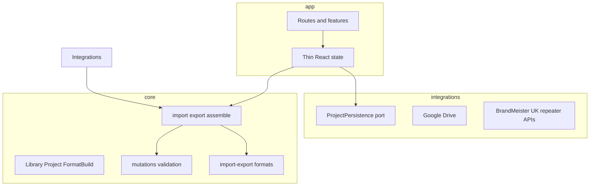
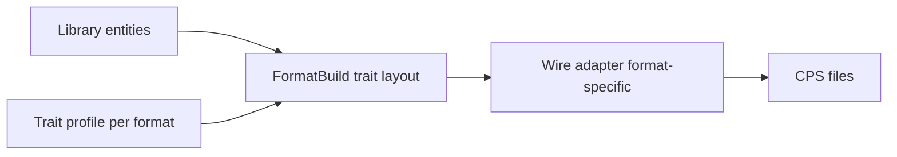

# Codeplug Studio — design constitution

**Background:** [docs/poc-migration/epic-1-context.md](docs/poc-migration/epic-1-context.md) — why Studio exists and how it differs from codeplug-tool.

Living product and architecture reference for **Codeplug Studio**. Agents and contributors read this before making structural decisions. User-facing copy lives in [README.md](README.md); agent workflow in [AGENTS.md](AGENTS.md)

---

## What this is

**Codeplug Studio** is a browser-based designer for amateur radio codeplug layouts. Operators design a **library** of channels, talk groups, and contacts, assemble **format-specific builds** for each radio workflow, and export CPS-ready files (and, where implemented, write radios directly over Web Serial). Studio does **not** replace vendor CPS as the only programming path — file export and third-party tools (e.g. CHIRP, NeonPlug) remain first-class.

This document may change as we learn.

---

## What changed from codeplug-tool

The archived [codeplug-tool](https://github.com/pskillen/codeplug-tool) prototype optimised for **round-trip fidelity** — re-importing an export should match the original CPS file. That goal shaped the data model, merge logic, provenance fields, and test strategy.

**Codeplug Studio explicitly drops that goal.**

| Old (codeplug-tool)                              | New (Codeplug Studio)                                             |
| ------------------------------------------------ | ----------------------------------------------------------------- |
| One codeplug per project, export to many formats | One **library** per project, many **format builds**               |
| Round-trip fidelity as quality bar               | **Import-first**; export is a **projection** with documented loss |
| Idempotent merge by wire name                    | **Best-effort** merge/match; user confirms ambiguity              |
| Heavy import provenance driving export           | Thin audit metadata; **model fields drive export**                |
| `Codeplug` as the primary edit surface           | **Library** is canonical; builds assemble subsets/layouts         |

Salvage from the old repo: wire-format reference docs, import parsers (simplified), UI primitives (map, tables, field widgets). Do not salvage the merge/provenance stack or route/store shape wholesale.

---

## Glossary

| Term                            | Meaning                                                                                                                                                                                                                                           |
| ------------------------------- | ------------------------------------------------------------------------------------------------------------------------------------------------------------------------------------------------------------------------------------------------- |
| **Project**                     | Named container: metadata + one library + zero or more format builds. Persisted as a unit.                                                                                                                                                        |
| **Library**                     | Master inventory — channels, talk groups, contacts, and shared concepts (e.g. zone _definitions_ where they are radio-agnostic). The operator's single source of truth for RF assets.                                                             |
| **Format build** (or **build**) | A format-scoped assembly: library selection + **trait-shaped layout** (zones, flat memories, scan lists, …) for one CPS workflow.                                                                                                                 |
| **Build capability trait**      | A behavioural concern radios may or may not support (zone grouping, scan lists, m×n channel expansion, …). Builds and build UI compose from traits; wire adapters map the result to CPS.                                                          |
| **Trait profile**               | The set of traits enabled for a build, usually fixed per format/profile definition — e.g. OpenGD77-1701 vs CHIRP UV-5R.                                                                                                                           |
| **Format**                      | A wire interchange family at the import/export boundary — e.g. OpenGD77 CSV, DM32 CSV, CHIRP CSV, native YAML. Siblings; none is the internal model.                                                                                              |
| **Variant / profile**           | Per-radio specialisation _within_ one format — selects trait profile and wire limits at export. Not a separate format.                                                                                                                            |
| **Codeplug** (export sense)     | The CPS-facing output of a build — files the vendor CPS accepts. Not the primary in-app edit model.                                                                                                                                               |
| **Scratch channel**             | Export-time companion memory per repeater (library channel): a faithful projection of the parent channel with a `Scratch` name marker so the operator can retune in the field without editing programmed talk-group rows. Not a zone export knob. |

User-facing copy may say "codeplug" when the operator would; internal docs use **library** and **build** for clarity.

---

## Design principles

### 1. Import-first

CPS → internal types must be thorough, tested against real fixtures, and documented per format under `docs/reference/export-formats/<format>/`. Import is the hard problem we invest in.

### 2. Export as projection

Export reads the library + build state and serialises to CPS wire values. Re-importing that export **may** differ from what was exported. We document what each format drops or transforms — we do not fake fidelity with wire stash or provenance replay.

### 3. Library, then builds

Operators curate once. Each format build gets a workflow suited to how that radio/CPS _behaves_ — not how its CSV happens to be laid out. Overlapping but disjoint terminology stays at the build layer, not in the library.

### 3a. Build workflows from capability traits

Radios differ along a small set of **behavioural concerns** (see [Build capability traits](#build-capability-traits)). Most radios are a permutation of these — not a unique snowflake requiring a one-off app model.

**FormatBuild** data and **build UI** are composed from a **trait profile** (which concerns apply and how). **Wire import/export adapters** remain specific to a format/profile (OpenGD77-1701 CSV, CHIRP UV-5R, …) but _project_ library + trait-shaped build state → wire at the boundary.

Do not model OpenGD77 zones in the library because OpenGD77 has a Zones.csv; model **zone grouping** on the build when the trait profile says the radio uses zones.

### 4. Vendor-neutral core

Radio caps, column names, wire strings, and profile limits apply only in `core/import-export/formats/`, `docs/reference/export-formats/<format>/`, and `docs/reference/radios/<manufacturer>/<model>/`. The library model, domain mutations, validation, and library CRUD UI do not embed `OPENGD77_`* constants or format-specific cardinality.

### 5. Merge and match — best effort

Importing into an existing library may propose matches (same frequency, similar name, same DMR ID). Heuristics plus explicit user choices. Full idempotency is desirable but not guaranteed.

### 6. Model fields are export source of truth

Export adapters serialise from typed model fields (+ explicit boundary rules). Do not stash raw CPS cells in metadata and prefer them on export. If a column is genuinely lossy, say so in format reference docs and tests.

### 7. Privacy

Operator data and tokens (maps, OAuth) stay in browser storage. Never commit secrets or personal CPS exports.

---

## Architecture

Single Vite + React + TypeScript SPA. No backend. Deploy to Cloudflare Pages via GitHub Actions (prod on full release publish).

```text
src/
  core/              # Zero React. Models, domain logic, import/export, services.
  integrations/      # Browser I/O: persistence port, cloud, external repeater APIs.
  app/               # React: routes, features, components, thin state adapters.
docs/
  features/          # Tier 1 — our product behaviour and internal model
  reference/         # Tier 2 (domain) + Tier 3 (export-formats / radios / remote-directories)
```

**Persistence:** `ProjectPersistence` port in `integrations/` — per-entity rows with optimistic `revision`. Phase 1: in-memory; Phase 2: IndexedDB. See [docs/poc-migration/storage.md](docs/poc-migration/storage.md).



### Application services

Routes and components call **services** (`importIntoLibrary`, `exportBuild`, `assembleBuild`, …), not format adapters or mutations directly. Keeps UI rewrites from breaking import logic.

---

## Data model (sketch)

Exact fields land in Phase 1. Shape at a glance:

```text
Project
  id, name, description, notes, author, createdAt, updatedAt
  library: Library
  builds: FormatBuild[]

Library
  channels: Channel[]
  talkGroups: TalkGroup[]
  contacts: Contact[]
  rxGroupLists: RxGroupList[]    # if modelled at library level
  zones: Zone[]                  # TBD: library-level vs build-level only

FormatBuild
  id, formatId, profileId?, name
  traitProfile: TraitProfile     # which capability traits apply
  channelSelections, zoneSelections, …  # libraryEntityId + overrides.name (wire names)
  layout: TraitLayout            # trait-shaped state (zones, scan lists, memory slots, …)
```

**Relationships:** UUID `id` foreign keys inside the library. `name` fields are display/export labels, not relationship keys.

**Separation:** `Library` holds RF semantics (frequency, mode, talk group ref, …). `FormatBuild` holds _target-specific_ state: which library rows participate, trait-shaped `layout`, and **persisted wire-name overrides** per selection. Wire adapters read `assemble(build, library)` — they do not dictate the internal library shape.

**Export is the union of both persisted layers.** The library is not “the export format in neutral clothing”; the build profile supplies the format-scoped mapping (organisation, limits, wire names). The archive [codeplug-tool](https://github.com/pskillen/codeplug-tool) instead held one internal codeplug and re-projected at export time without durable per-target customisation.

**Naming:** Library `name` fields are human labels. CPS wire names for a given radio live on `FormatBuild` selection `overrides.name` (pre-filled on import or by profile shortening rules; operator-editable and persisted). This matters especially for profile length limits (e.g. 16 characters) and m×n / multi-talkgroup expansion, where composed names like `GB7GL Glasgow Scotland TS2` must be abbreviated per target.

**Open questions** (resolve during Phase 1 modelling):

- Exact trait enum and which profiles enable which traits
- Whether trait layout types are a discriminated union per trait or a shared bag with optional sections
- Native YAML serialises the full project (library + builds) as interchange

---

## Import and export

### Import

1. Detect or select format (+ profile where needed).
2. Parse by **header name**, not column index.
3. Map wire → library types at the format adapter.
4. Optionally create or update a format build from import layout.
5. Offer merge UI when library already has overlapping entities.

### Export

1. Select build (format + profile).
2. `assemble(build, library)` → export projection.
3. Serialise projection → CPS files via format adapter.
4. Surface warnings (truncation, dropped fields, cardinality limits).

### Formats and phases

| Phase | Formats / capabilities                        |
| ----- | --------------------------------------------- |
| 2     | No CSV/YAML I/O — in-app library editing only |
| 3     | Native YAML + Google Drive                    |
| 4     | OpenGD77 CSV                                  |
| 5     | Baofeng DM32 CSV                              |
| 6     | CHIRP CSV (UV-5R, RT-95, UV-21)               |

OpenGD77 is one format among many. DM32 and CHIRP are unrelated siblings, not variants of OpenGD77.

---

## Build capability traits

Radios and CPS tools differ in how they _organise_ channels, not just in CSV column names. A manageable set of **traits** describes those behaviours. A **trait profile** (per format/profile) declares which traits apply; the build model and build UI inherit that combination.

Known traits (initial set — expect more):

| Trait                            | Behaviour                                                            | Example radios / formats             |
| -------------------------------- | -------------------------------------------------------------------- | ------------------------------------ |
| **Zone grouping**                | Channels grouped into named zones; operator switches zone on radio   | OpenGD77, DM32                       |
| **Flat memory list**             | No zones — one ordered list of channels/memories                     | CHIRP analogue                       |
| **Per-channel scan flag**        | Scan enabled/skipped per channel; no separate scan-list entity       | Many analogue rigs                   |
| **Scan lists**                   | Named lists of channels used for scanning, distinct from TX grouping | DM32                                 |
| **Zone as scan list**            | Zone membership doubles as scan scope (zone _is_ the scan list)      | OpenGD77                             |
| **Multi talk group per channel** | One RF channel; operator picks repeater + TG (or contact) on channel | OpenGD77-style DMR                   |
| **m×n channel expansion**        | Radio requires one memory per repeater×talkgroup pair                | DM32, Most commerical digital radios |

Most target radios are a **permutation** of these (plus caps: max channels, max zones, name length, …). Caps belong at the wire adapter / profile; traits belong in shared build model + UI modules.



**UI implication:** `app/features/builds/` shares trait modules — e.g. `zone-grouping/`, `scan-lists/`, `flat-memories/` — composed per profile. Format-specific pages wire the modules their profile needs.

**Adapter implication:** OpenGD77 and DM32 adapters both map **zone grouping** trait layout to different CSV shapes. CHIRP maps **flat memory list** + **per-channel scan flag** to its columns. Adapters stay format-specific; they should not each invent a different internal zone model.

---

## Testing

### Why round-trip was a trap

In codeplug-tool, **full import→export→re-import equality** often stood in for proper mapping tests because we lacked explicit fixtures for each direction. That pushed complexity into provenance, merge idempotency, and the data model.

**Do not repeat that.** Test each mapping independently with constructed fixtures.

### Required mapping tests

| Direction                    | Input                                 | Assert                                                                      |
| ---------------------------- | ------------------------------------- | --------------------------------------------------------------------------- |
| **Wire → internal (import)** | CPS fixture files                     | Expected library entities + build trait layout (golden JSON/YAML snapshots) |
| **Internal → wire (export)** | Constructed library + build in memory | Expected CPS columns/rows (golden files or normalised snapshots)            |
| **Assemble**                 | Library + `FormatBuild`               | Export projection object before serialisation                               |

Import and export tests use **different fixtures**. Export tests do not require importing first. Overlap between directions is a nice cross-check, not the definition of correctness.

| Layer              | Bar                                                                           |
| ------------------ | ----------------------------------------------------------------------------- |
| **Import mapping** | Per-format fixture suite → internal model                                     |
| **Export mapping** | Per-format constructed model → wire output                                    |
| **Trait assembly** | Library + trait layout → projection; shared across formats sharing traits     |
| **Domain**         | Unit tests on mutations, validation, merge heuristics                         |
| **Round-trip**     | Optional smoke only; never the primary gate; document expected loss when used |

System tests target `core/services` and format adapters, not React routes.

---

## Documentation tiers

| Tier                         | Location                                   | Contents                                                             |
| ---------------------------- | ------------------------------------------ | -------------------------------------------------------------------- |
| 1 — Product / internal model | `docs/features/`                           | Library, builds, entities, UUID rules — no CPS column tables         |
| 2 — Domain reference         | `docs/reference/*.md` (root only)          | Bands, channel modes, display conventions — link out for wire detail |
| 3 — Adapter / radio / directory wire | `docs/reference/export-formats/<format>/`, `docs/reference/radios/<mfr>/<model>/`, `docs/reference/remote-directories/<dir>/` | CPS columns; radio caps/ladders/layout; remote API shapes |

See [`.cursor/rules/documentation-boundaries.mdc`](.cursor/rules/documentation-boundaries.mdc).

---

## Phased delivery

Aligned with [Epic #1](https://github.com/pskillen/codeplug-studio/issues/1):

| Phase   | Outcome                                                             |
| ------- | ------------------------------------------------------------------- |
| **0**   | This document, `AGENTS.md`, cursor rules/skills                     |
| **1**   | Scaffold, core models, persistence port (in-memory), CI/Pages       |
| **2**   | Library UI, map, repeater APIs, IndexedDB persistence — no file I/O |
| **3**   | Native YAML, Google Drive                                           |
| **4–6** | CPS formats per epic                                                |

---

## Non-goals (for now)

- Replacing vendor CPS as the sole programming path (file export and sibling tools stay supported)
- Cloud backend (browser + optional Drive OAuth only)
- Perfect merge idempotency or round-trip fidelity
- Supporting every CPS format or every radio — extensible adapter / protocol pattern; targets added incrementally

### Intentional goals (phased)

- **CPS file interchange** (CSV, YAML, `.neonplug`, …) — shipped and ongoing
- **Browser radio I/O** (Web Serial / related transports) — planned under epic [#594](https://github.com/pskillen/codeplug-studio/issues/594); protocol work must credit reverse-engineering lineages (CHIRP, NeonPlug) in UI attributions
- **Target versions** — **CPS version** scopes file/CSV adapters; **firmware version** scopes direct-write ([#593](https://github.com/pskillen/codeplug-studio/issues/593))

---

## Revision log

| Date       | Change                                                                                                                                  |
| ---------- | --------------------------------------------------------------------------------------------------------------------------------------- |
| 2026-07-22 | Browser WebSerial radio I/O as intentional goal; CPS/firmware versions ([#595](https://github.com/pskillen/codeplug-studio/issues/595)) |
| 2026-06-29 | Initial draft on branch `2/pskil/design-md`                                                                                             |
| 2026-06-29 | Build capability traits; bidirectional mapping test strategy                                                                            |
