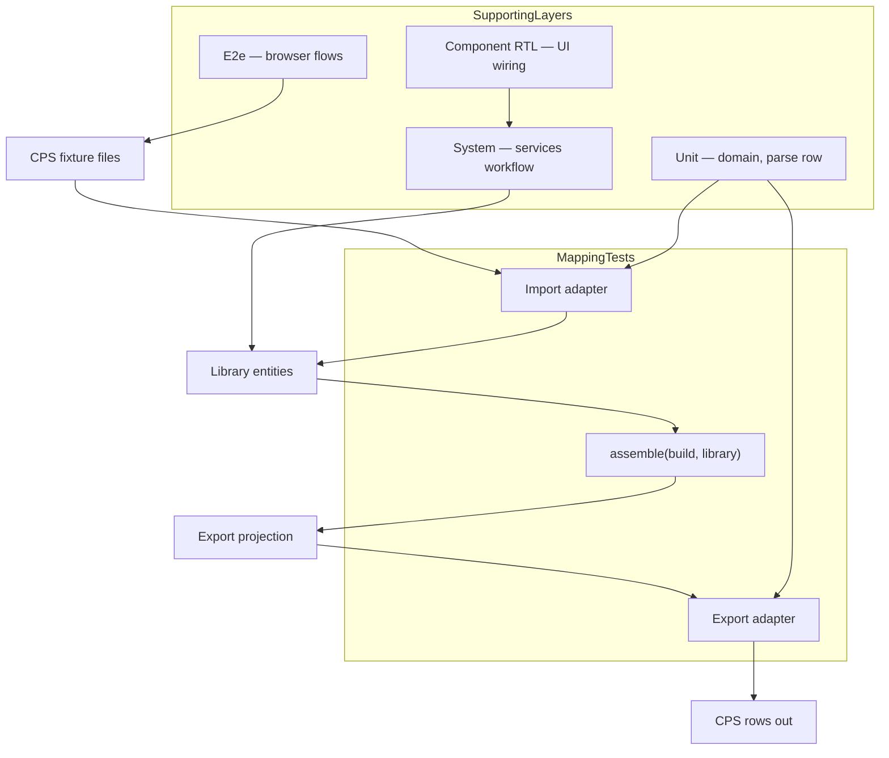

# Testing strategy

Contributor guide for automated tests in Codeplug Studio.

**North star:** [DESIGN.md — Testing](../../DESIGN.md#testing) — bidirectional **mapping** tests (import fixture → library + build; constructed library + build → wire), not full round-trip equality as the primary quality gate.

These docs describe **how we should test** (prescriptive). They are not a reverse-engineered audit of every existing `*.test.ts` file.

## Test layers

| Layer     | Doc                                  | Proves                                                            | Must not duplicate           |
| --------- | ------------------------------------ | ----------------------------------------------------------------- | ---------------------------- |
| Mapping   | [mapping-tests.md](mapping-tests.md) | **Primary** — wire ↔ library/build per direction                  | Browser UI, IndexedDB        |
| Unit      | [unit.md](unit.md)                   | Single function, parser row, domain rule                          | Full multi-file workflow     |
| Fixtures  | [fixtures.md](fixtures.md)           | Shared CPS bundles, normalisation rules                           | —                            |
| System    | [system.md](system.md)               | `core/services` workflows (import into library, assemble, export) | File picker, download events |
| Component | [component.md](component.md)         | Modal copy, form wiring, confirm/cancel                           | CSV byte equality            |
| E2e       | [e2e.md](e2e.md)                     | Real browser: upload, reload, ZIP download                        | Parser edge cases in unit    |

## npm scripts

| Script     | Command              | Scope                                                                                                                            |
| ---------- | -------------------- | -------------------------------------------------------------------------------------------------------------------------------- |
| All Vitest | `npm test`           | Colocated `src/**/*.test.ts(x)`                                                                                                  |
| Watch      | `npm run test:watch` | Same, interactive                                                                                                                |
| Coverage   | —                    | **Planned** — not in `package.json` yet                                                                                          |
| System     | —                    | **Planned** — no `src/test/system/` yet                                                                                          |
| E2e        | `npm run test:e2e`   | Playwright — cookie consent smoke shipped ([#176](https://github.com/pskillen/codeplug-studio/issues/176)); see [e2e.md](e2e.md) |

Run before commit when touching application code: `npm run lint`, `npm run format:check`, `npm test`, and `npm run build` when types or build config change. See [git-workflow](../../.cursor/skills/git-workflow/SKILL.md).

## CI on pull requests

Every pull request and push to `main` runs [`.github/workflows/ci.yml`](../../.github/workflows/ci.yml). Vitest emits `test-results/junit.xml` in CI; [dorny/test-reporter](https://github.com/dorny/test-reporter) publishes per-test pass/fail on the PR Checks tab.

| Check              | Script                 | CI                 | Notes                                          |
| ------------------ | ---------------------- | ------------------ | ---------------------------------------------- |
| Prettier           | `npm run format:check` | Yes                |                                                |
| ESLint             | `npm run lint`         | Yes                |                                                |
| Unit tests         | `npm run test`         | Yes                | Vitest; JUnit XML + dorny/test-reporter on PRs |
| Type-check + build | `npm run build`        | Yes                | `tsc -b && vite build`                         |
| Coverage           | —                      | **Planned**        |                                                |
| E2e                | `npm run test:e2e`     | Yes (separate job) | Playwright on `vite preview`; consent smoke    |

Docs-only PRs: `format:check` + link audit is sufficient.

## Where to add tests

1. **Changing a parser or serialiser column** → unit test beside `parse.ts` / `serialise.ts`; extend mapping scenario if semantics cross files.
2. **Changing import into library / merge** → service test in `src/core/services/`; system scenario when multi-step workflow lands.
3. **Changing UI only** → component RTL under `src/app/` or e2e when browser behaviour matters.
4. **New format adapter** → follow [adding-a-new-format.md](../features/import-export/adding-a-new-format.md); register under `src/core/import-export/formats/<format>/`; reference docs under `docs/reference/<format>/`; fixture bundle; fill adapter matrix in [mapping-tests.md](mapping-tests.md).
5. **Pure domain helper** (geo, validation, maidenhead) → colocated `*.test.ts` in `src/core/` or `src/integrations/`.

## Documentation map

| Doc                                  | Contents                                                                          |
| ------------------------------------ | --------------------------------------------------------------------------------- |
| [mapping-tests.md](mapping-tests.md) | **Primary** — bidirectional fixture strategy, assemble, optional round-trip smoke |
| [unit.md](unit.md)                   | Colocated Vitest by layer                                                         |
| [fixtures.md](fixtures.md)           | CPS bundles, `sample-exports/` policy                                             |
| [system.md](system.md)               | Workflow harness — **status: planned**                                            |
| [component.md](component.md)         | RTL patterns — **status: planned**                                                |
| [e2e.md](e2e.md)                     | Playwright scope — **status: planned**                                            |

## Related

| Resource             | Link                                                                      |
| -------------------- | ------------------------------------------------------------------------- |
| Build and deploy     | [docs/build/README.md](../README.md)                                      |
| Data model           | [docs/features/data-model/README.md](../../features/data-model/README.md) |
| OpenGD77 wire format | [docs/reference/opengd77/](../../reference/opengd77/README.md)            |
| PR checks            | [`.github/workflows/ci.yml`](../../.github/workflows/ci.yml)              |
