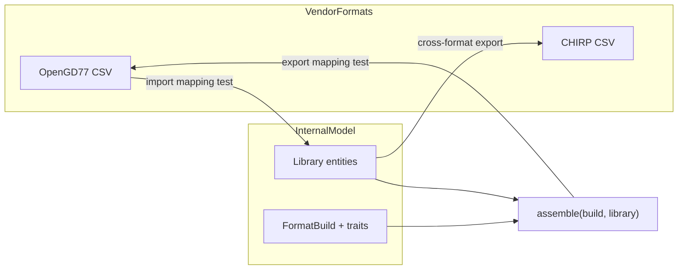

# Mapping tests

**Purpose:** Define how we prove vendor ↔ internal model conversions are correct. This is the **primary** testing concern for import/export work. For layer boundaries and npm scripts, see the [testing hub](README.md).

**Studio thesis:** Test each direction independently — do not rely on full import→export→re-import equality as the main gate. See [DESIGN.md — Testing](../../DESIGN.md#testing).

## Internal model as hub

All vendor formats convert through the vendor-neutral **library** and **format build** layout (`src/core/models/`). Import adapters parse CPS files into library entities (and optionally build trait state). Export runs `assemble(build, library)` then serialises the projection to wire columns.

Wire-format column detail: `docs/reference/<format>/`. Strategy docs cite **outcomes** (golden snapshots, lossy fields), not every column.

## Required mapping tests

| Direction                    | Input                                 | Assert                                                                      |
| ---------------------------- | ------------------------------------- | --------------------------------------------------------------------------- |
| **Wire → internal (import)** | CPS fixture files                     | Expected library entities + build trait layout (golden JSON/YAML snapshots) |
| **Internal → wire (export)** | Constructed library + build in memory | Expected CPS columns/rows (golden files or normalised snapshots)            |
| **Assemble**                 | Library + `FormatBuild`               | Export projection object before serialisation                               |

## Import fidelity

**Definition:** Each vendor row maps to the correct library fields (and build layout when the format carries organisation).

| Concern                   | Where to test                                                    |
| ------------------------- | ---------------------------------------------------------------- |
| Column → field mapping    | Unit tests beside `parse.ts`                                     |
| File classification       | Adapter `detectKind` tests                                       |
| Multi-file batch assembly | `importIntoLibrary` integration tests                            |
| UUID FK resolution        | Import resolves wire names to library `id` refs at boundary only |

**Rules:**

- Parse by **header name**, never column index.
- Channel names are **case-sensitive** wire identifiers at the format edge.
- Rows that fail validation should surface in import result errors; skipped files reported explicitly.

**Code anchors (planned):** `src/core/import-export/formats/<format>/`, `src/core/services/importIntoLibrary.ts`.

## Export fidelity

**Definition:** Each library entity and build layout field maps to the correct vendor columns and values — from **typed model fields**, not provenance replay.

| Concern                         | Where to test                                             |
| ------------------------------- | --------------------------------------------------------- |
| Field → column mapping          | Unit tests beside `serialise.ts`                          |
| Trait layout → zones/scan lists | Per-format export with constructed `FormatBuild`          |
| Name-based FK denormalisation   | Wire names resolved from UUID refs at serialise time only |

**Code anchors:** `src/core/import-export/formats/<format>/`, `src/core/services/exportBuild.ts`, `src/core/services/assemble.ts`.

## Scenario taxonomy

| Scenario                         | What it proves                            | Layer                     | Status                         |
| -------------------------------- | ----------------------------------------- | ------------------------- | ------------------------------ |
| **Import mapping**               | Fixture → golden library (+ build)        | Adapter + service         | Planned (Phase 4+)             |
| **Export mapping**               | Constructed library + build → golden wire | Adapter + service         | Planned                        |
| **Assemble**                     | Trait profile shapes export projection    | Unit / service            | Shipped (`assemble.test.ts`)   |
| **Same-format round-trip smoke** | A → internal → A roughly stable           | Optional integration      | Secondary — not primary gate   |
| **Cross-format**                 | A → library → B export                    | Adapter matrix            | Planned                        |
| **Lossy fields**                 | Known non-surviving columns documented    | Reference + mapping tests | Per `docs/reference/<format>/` |

### Round-trip (optional smoke only)

Full re-import equality is useful as a **smoke** test when import and export both exist, but failures must be diagnosed via directional golden tests. Do not stash raw wire cells in metadata to make round-trip pass.

Pattern (when adapters ship):

- Deterministic ids via test harness stub.
- Compare normalised wire output or semantic library equality — not opaque provenance bags.

## Adapter matrix (fill as formats ship)

| Format   | Import golden | Export golden | Round-trip smoke |
| -------- | ------------- | ------------- | ---------------- |
| OpenGD77 | Planned       | Planned       | Optional         |
| CHIRP    | Planned       | Planned       | Optional         |
| DM32     | Planned       | Planned       | Optional         |

## Related

- [Testing hub](README.md)
- [Fixtures](fixtures.md)
- [Unit tests](unit.md)
- [multi-talkgroup-expansion.md](../../reference/multi-talkgroup-expansion.md) — export-time expansion rules
