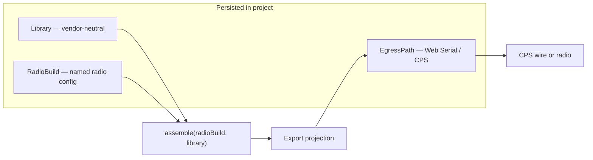
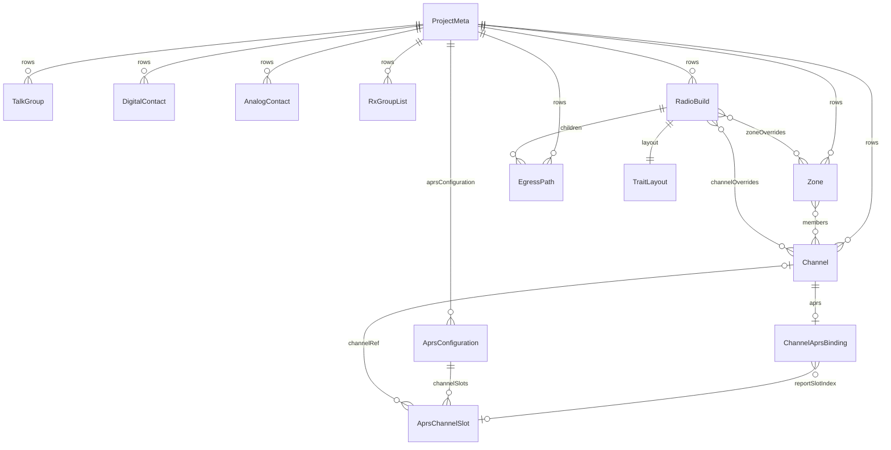

# Internal data model

Tier-1 reference for the vendor-neutral **library + radio build + egress** model. Wire-format mapping lives in `docs/reference/export-formats/<format>/` trees and import/export adapters — not here.

**Tracking:** Phase 1 [#4](https://github.com/pskillen/codeplug-studio/issues/4) · Persistence planning: [storage.md](../../poc-migration/storage.md)

**Source:** `src/core/models/`

## Two / three persisted layers (not one export format)

Codeplug Studio separates **what you know about RF** from **how a specific radio configuration is assembled** and **how that assembly leaves Studio**. All are persisted in the project — export / direct-write is the **union** of library + radio build (+ selected egress), not a one-shot projection from a single internal shape.

| Layer | Model | Vendor-neutral? | Persisted? | Role |
| --- | --- | --- | --- | --- |
| **Library** | `Channel`, `TalkGroup`, `Zone`, … | **Yes** | Yes | Canonical RF inventory — frequencies, modes, contacts, grouping you curate once |
| **Radio build** | `RadioBuild` (`radioTargetId` + overrides / layout) | No (scoped to a catalog radio) | **Yes** | One **named** mapping of the library onto that radio’s traits and wire limits |
| **Egress path** | `EgressPath` (`formatId` / `profileId` + optional hydration) | No (CPS file or Web Serial) | **Yes** | How that build is written or downloaded; donor / clone retain bags live here |

**Many radio builds may share one `radioTargetId`.** Identity is the build UUID and display `name` (e.g. two UV-5R Mini builds for Team A vs Team B with different channel subsets). Each build owns its own egress children. See [builds hub](../builds/README.md) and [#654](https://github.com/pskillen/codeplug-studio/issues/654).



### Contrast with codeplug-tool (archive)

The old repo held **one internal codeplug** already shaped like a single CPS workflow. Choosing another export format re-projected that same in-memory model at click time — there was no durable per-target build state, and wire-name shortening was largely an export-time side effect.

Studio instead keeps a **vendor-neutral library** plus **one or more persisted `RadioBuild` rows** per project, each with child **`EgressPath`** rows for CPS file and Web Serial pathways. The operator can accept pre-populated build values (from import or profile defaults) or customise them; those customisations survive the next export.

### Why radio builds exist

1. **Different radio concepts** — zones, scan lists, RX group lists, flat memory lists, and m×n channel expansion are not universal. Catalog radio targets declare which capability traits apply; `RadioBuild.layout` holds the trait-shaped organisation for that target.
2. **Different wire limits** — especially **name length** (e.g. 16 characters on Baofeng 1701). Library `name` fields are human-oriented labels; the wire name for a given export lives on the build (`channelOverrides[].wireName`, and analogous overrides on zones, talk groups, etc.). Import or profile rules may pre-fill shortened names; the operator can edit and persist overrides before export.
3. **Channel expansion** — when m×n or multi-talkgroup expansion applies, generated wire names like `GB7GL Glasgow Scotland TS2` routinely exceed profile limits unless aggressively abbreviated. That abbreviation is **build-scoped and persisted**, not recomputed silently on every export (so the operator can review and tune).

Wire adapters read `assemble(build, library)` — they do not define the internal library shape. See [DESIGN.md — Data model](../../../DESIGN.md#data-model-sketch) and [multi-talkgroup-expansion.md](../../reference/multi-talkgroup-expansion.md).

## Overview

A **project** holds operator metadata and references many **persistable rows**: library entities (channels, zones, talk groups, contacts, RX group lists), **radio builds**, and **egress paths**.

The library is the RF inventory (vendor-neutral). Each **radio build** is a persisted mapping from that library onto one catalog radio target (`radioTargetId`), including layout and per-entity wire-name overrides. **Egress paths** are children that carry `formatId` / `profileId`, delivery `kind`, and optional operation hydration.



## Schema version

`STUDIO_SCHEMA_VERSION = 22` in `src/core/models/schemaVersion.ts`. Bumps when persisted row shapes change. v15 adds digital APRS entities (`AprsConfiguration`, `Channel.aprs`). v16 adds the IndexedDB `aprsConfigurations` object store. v17 migrates to a **singleton** `Library.aprsConfiguration`, replaces `ChannelAprsBinding.reportChannelRef` with `reportSlotIndex`, and removes `FormatBuild.activeAprsConfigurationId`. v18 adds `Library.channelDefaults` / `ProjectMeta.channelDefaults`, tri-state `Channel.forbidTransmit` / `Channel.txPermit`, and mode-profile behavioural overrides (`ChannelModeProfileDMR.sendTalkerAlias`, `ChannelModeProfileAnalog.analogSquelchMode`). v19 adds `Library.zoneDefaults` / `ProjectMeta.zoneDefaults`, tri-state `ZoneMemberEntry.includeInScanList`, build `defaultIncludeInZoneDerivedScanList`, and layout `scanMemberInclusion`. v20 adds optional `Zone.order` (1-based library baseline for top-level zone export order). v21 adds optional `FormatBuild.cpsWireHydration` (superseded on egress in v22). **v22** ([#654](https://github.com/pskillen/codeplug-studio/issues/654)): replaces legacy `formatBuilds` IndexedDB store with `radioBuilds` + `egressPaths`; hydration moves to `EgressPath.hydration` — no build-data migration.

## Persistable rows

Every stored entity extends `PersistableRow`:

| Field       | Purpose                                     |
| ----------- | ------------------------------------------- |
| `id`        | UUID primary key                            |
| `projectId` | Owning project                              |
| `revision`  | Optimistic concurrency (integrations layer) |
| `updatedAt` | ISO timestamp                               |

See [storage.md](../../poc-migration/storage.md) — Phase 1 uses in-memory row maps; Phase 2 adds IndexedDB.

## Project metadata

`ProjectMeta` — name, description, notes, author, `createdAt`. One metadata row per project (`id === projectId`).

## Library entities

Vendor-neutral RF semantics only. UUID `id` FKs; `name` is a **human display label** — not the CPS wire string for a particular radio.

| Entity              | Notes                                                                                                                                                                           |
| ------------------- | ------------------------------------------------------------------------------------------------------------------------------------------------------------------------------- |
| `Channel`           | Frequency (Hz), callsign, power, `location`, `maidenheadLocator`, `useLocation`, `hideFromInternalMap` (app-only map visibility), scan skip, `forbidTransmit`; `modeProfiles[]` |
| `Zone`              | Inventory grouping — `members` as channel `EntityRef[]`; export flags on the zone row                                                                                           |
| `TalkGroup`         | Digital group call — `mode`, `digitalId`                                                                                                                                        |
| `DigitalContact`    | Digital private call — `mode`, `digitalId`                                                                                                                                      |
| `AnalogContact`     | Analogue call sign / code                                                                                                                                                       |
| `RxGroupList`       | Promiscuous RX list — `members` as talk-group `EntityRef[]`                                                                                                                     |
| `ScanList`          | Dedicated scan list — ordered `memberChannelIds`                                                                                                                                |
| `AprsConfiguration` | Digital APRS global config — beacon timing, position source, `channelSlots[]`; **one per project**; see [aprs](../aprs/README.md)                                               |

`Channel.aprs` (optional `ChannelAprsBinding`) holds per-channel digital APRS flags when enabled. Omit = APRS off for that channel.

Mode-specific channel fields live on `modeProfiles` entries. Union type `ChannelModeProfile`:

| Profile                    | `mode` values     | Key fields                                                                           |
| -------------------------- | ----------------- | ------------------------------------------------------------------------------------ |
| `ChannelModeProfileAnalog` | `fm`, `am`, `ssb` | bandwidth, squelch, RX/TX tone; `ssbSideband` (`usb` \| `lsb`) when `mode === 'ssb'` |
| `ChannelModeProfileDMR`    | `dmr`             | colour code, timeslot, DMR ID, contact ref, RX group list                            |
| `ChannelModeProfileDstar`  | `dstar`           | UR / RPT1 / RPT2 calls                                                               |
| `ChannelModeProfileYsf`    | `ysf`             | DG-ID, WIRES-X DTMF ID                                                               |
| `ChannelModeProfileNxdn`   | `nxdn`            | RX/TX RAN, unit ID, talk group ref                                                   |
| `ChannelModeProfileTetra`  | `tetra`           | MCC, MNC, GSSI, color code, talk group ref                                           |
| `ChannelModeProfileStub`   | `p25`, `m17`      | mode label only (typed profiles deferred)                                            |

`maidenheadLocator` and `location` may both be set; export adapters prefer coordinates when they conflict. See `reconcileChannelLocation` in `src/core/domain/channelLocation.ts`.

`hideFromInternalMap` is **internal-only** — persisted in native YAML and IndexedDB; omitted from all CPS wire formats. When `true`, the channel is excluded from embedded Codeplug Studio maps but remains in lists, builds, distance sort, and export.

Library CRUD edits this layer only — no radio name-length caps, no format wire strings. See [library](../library/README.md).

## Radio build

`RadioBuild` — one **persisted** named configuration for a catalog radio target within a project. Multiple builds can reference the same `radioTargetId` with different organisation and wire names.

| Field                  | Purpose                                                                                   |
| ---------------------- | ----------------------------------------------------------------------------------------- |
| `radioTargetId`        | Catalog radio target (`baofeng-uv5r-mini`, `baofeng-dm32uv`, …) — not unique per project |
| `name`                 | Operator label for this build (e.g. "UV-5R Team A")                                       |
| `channelOverrides`     | Sparse channel customisation — `excluded` omits from build; `wireName` is CPS wire string |
| `zoneOverrides`        | Sparse zone customisation                                                                 |
| `talkGroupOverrides`   | Sparse talk group customisation                                                           |
| `contactOverrides`     | Sparse digital or analogue contact customisation                                          |
| `rxGroupListOverrides` | Sparse RX group list customisation                                                        |
| `scanListOverrides`    | Sparse dedicated scan list customisation                                                  |
| `layout`               | `TraitLayout` — trait-shaped organisation (zone order, flat memories, …)                  |
| `exportSettings`       | Assemble-affecting prefs (name shortening, scan defaults, expansion flags, …)             |
| `defaultEgressPathId`  | Preferred egress for Export UI                                                            |
| `exportUnlinked*`      | Inclusion toggles for orphan library entities on export                                   |

Traits for the build come from `src/core/radio-targets/catalog.ts` for `radioTargetId` (aligned with `TRAIT_PROFILES` for export limits).

### Entity overrides (wire names)

Each `*Overrides` row points at a library entity by `libraryEntityId`:

- **No row** — entity is included; wire name is generated at preview/export.
- **`excluded: true`** — entity is omitted from this build's export.
- **`forceInclude: true`** — zone overrides only; export as standalone zone despite library `omitFromExport` (`excluded` wins if both set).
- **`wireName`** — persisted CPS wire string for that entity.

This is the main place **profile-specific naming limits** land without polluting the vendor-neutral library.

### Trait layout

`TraitLayout` sections (`ZoneGroupingLayout`, `FlatMemoryLayout`, …) express export-time organisation driven by the profile's capability traits. Library `Zone` membership is the source of truth for which channels belong to a zone; the build layout controls order and format-specific export knobs (e.g. DM32 scratch channel / scan-list flags on `ZoneGroupingLayout` zone entries).

Build UI and layout compose from traits; wire adapters map `assemble(build, library)` at export through the active egress. See [builds hub](../builds/README.md).

## Egress path

`EgressPath` — one **persisted** delivery pathway under a `RadioBuild`. A target may seed several egress children (e.g. Web Serial + NeonPlug + CHIRP for UV-5R Mini).

| Field           | Purpose                                                                 |
| --------------- | ----------------------------------------------------------------------- |
| `radioBuildId`  | Parent build FK                                                         |
| `formatId`      | Adapter family (`neonplug`, `chirp`, `radio-io`, …)                     |
| `profileId`     | Variant within the format — export limits and wire adapter selection    |
| `kind`          | `cps-file` or `web-serial`                                              |
| `label`         | Optional display label for the egress switcher                          |
| `hydration`     | Optional `CpsWireHydration` — NeonPlug donor or radio-clone retain only |

Hydration is an egress-scoped escape hatch for unmodelled retain (donor merge, full clone image). Wire names and trait layout stay on `RadioBuild`.

## Build capability traits

Declared per profile in `TRAIT_PROFILES` (`src/core/models/traits.ts`). Examples:

| Profile               | Traits                                                 |
| --------------------- | ------------------------------------------------------ |
| `opengd77-1701`       | zone grouping, zone-as-scan-list, multi-TG per channel |
| `dm32-baofeng-dm32uv` | zone grouping, scan lists, m×n expansion               |
| `chirp-uv5r`          | flat memory list, per-channel scan flag                |

### Export path (recap)

```text
library (vendor-neutral)  +  RadioBuild (persisted overrides, layout, exportSettings)
        → assemble(build, library)
        → export projection
        → EgressPath (formatId, profileId, optional hydration)
        → wire adapter (format/profile)
        → CPS files or radio image
```

Neither layer alone is the export format — the wire output is always the combination of library + build through the selected egress.

## Factories and validation

- `src/core/domain/factories.ts` — `newProjectMeta`, `newChannel`, `newZone`, `newRadioBuild`, `newEgressPath`, `newRadioBuildWithEgresses`, …
- `src/core/domain/validation.ts` — vendor-neutral guards (non-empty names, ref targets exist)

## Implementation status

| Area                      | Status                                                                                                 |
| ------------------------- | ------------------------------------------------------------------------------------------------------ |
| Core types                | Shipped (Phase 1)                                                                                      |
| `ProjectPersistence` port | Shipped — in-memory + IndexedDB                                                                        |
| IndexedDB persistence     | Shipped (Phase 2)                                                                                      |
| Import/export adapters    | Phase 4+                                                                                               |
| Library CRUD UI           | Shipped (Phase 2)                                                                                      |
| Build CRUD UI + overrides | Shipped — [#82](https://github.com/pskillen/codeplug-studio/issues/82)                                 |
| RadioBuild + EgressPath   | Shipped — [#654](https://github.com/pskillen/codeplug-studio/issues/654); schema v22                 |

## Related

- [DESIGN.md](../../../DESIGN.md) — product constitution
- [epic-1-context.md](../../poc-migration/epic-1-context.md) — migration background
