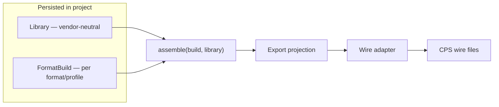
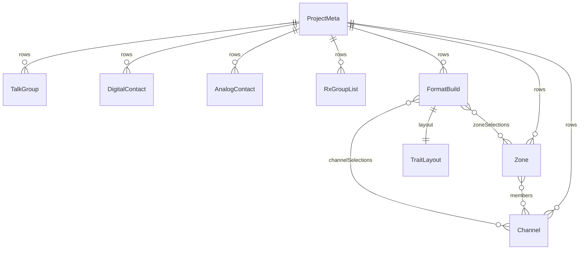

# Internal data model

Tier-1 reference for the vendor-neutral **library + format build** model. Wire-format mapping lives in `docs/reference/<format>/` trees and import/export adapters — not here.

**Tracking:** Phase 1 [#4](https://github.com/pskillen/codeplug-studio/issues/4) · Persistence planning: [storage.md](../../poc-migration/storage.md)

**Source:** `src/core/models/`

## Two persisted layers (not one export format)

Codeplug Studio separates **what you know about RF** from **how a specific radio/CPS expects it on the wire**. Both are persisted in the project — export is the **union** of library + build, not a one-shot projection from a single internal shape.

| Layer            | Model                             | Vendor-neutral?                         | Persisted? | Role                                                                                           |
| ---------------- | --------------------------------- | --------------------------------------- | ---------- | ---------------------------------------------------------------------------------------------- |
| **Library**      | `Channel`, `TalkGroup`, `Zone`, … | **Yes**                                 | Yes        | Canonical RF inventory — frequencies, modes, contacts, grouping you curate once                |
| **Format build** | `FormatBuild` per target workflow | No (scoped to `formatId` + `profileId`) | **Yes**    | Maps that library to one CPS workflow: trait layout, entity selection, **wire-name overrides** |



### Contrast with codeplug-tool (archive)

The old repo held **one internal codeplug** already shaped like a single CPS workflow. Choosing another export format re-projected that same in-memory model at click time — there was no durable per-target build state, and wire-name shortening was largely an export-time side effect.

Studio instead keeps a **vendor-neutral library** plus **one or more persisted `FormatBuild` rows** per project. The operator can accept pre-populated build values (from import or profile defaults) or customise them; those customisations survive the next export.

### Why format builds exist

1. **Different radio concepts** — zones, scan lists, RX group lists, flat memory lists, and m×n channel expansion are not universal. Trait profiles declare which concepts apply; `FormatBuild.layout` holds the trait-shaped organisation for that target.
2. **Different wire limits** — especially **name length** (e.g. 16 characters on Baofeng 1701). Library `name` fields are human-oriented labels; the wire name for a given export lives on the build (`channelSelections[].overrides.name`, and analogous overrides on zones, talk groups, etc.). Import or profile rules may pre-fill shortened names; the operator can edit and persist overrides before export.
3. **Channel expansion** — when m×n or multi-talkgroup expansion applies, generated wire names like `GB7GL Glasgow Scotland TS2` routinely exceed profile limits unless aggressively abbreviated. That abbreviation is **build-scoped and persisted**, not recomputed silently on every export (so the operator can review and tune).

Wire adapters read `assemble(build, library)` — they do not define the internal library shape. See [DESIGN.md — Data model](../../../DESIGN.md#data-model-sketch) and [multi-talkgroup-expansion.md](../../reference/multi-talkgroup-expansion.md).

## Overview

A **project** holds operator metadata and references many **persistable rows**: library entities (channels, zones, talk groups, contacts, RX group lists) and **format builds**.

The library is the RF inventory (vendor-neutral). Each **format build** is a persisted mapping from that library to one CPS target (`formatId` + `profileId`), including layout and per-entity wire-name overrides.



## Schema version

`STUDIO_SCHEMA_VERSION = 1` in `src/core/models/schemaVersion.ts`. Bumps when persisted row shapes change.

## Persistable rows

Every stored entity extends `PersistableRow`:

| Field       | Purpose                                     |
| ----------- | ------------------------------------------- |
| `id`        | UUID primary key                            |
| `projectId` | Owning project                              |
| `revision`  | Optimistic concurrency (integrations layer) |
| `updatedAt` | ISO timestamp                               |

See [storage.md](../../poc-migration/storage.md) — Phase 1 uses in-memory row maps; Phase 2 adds IndexedDB.

## Project metadata

`ProjectMeta` — name, description, notes, author, `createdAt`. One metadata row per project (`id === projectId`).

## Library entities

Vendor-neutral RF semantics only. UUID `id` FKs; `name` is a **human display label** — not the CPS wire string for a particular radio.

| Entity           | Notes                                                                                    |
| ---------------- | ---------------------------------------------------------------------------------------- |
| `Channel`        | Frequency (Hz), callsign, power, location, scan skip; `modeProfiles` (FM / DMR profiles) |
| `Zone`           | Inventory grouping — `members` as channel `EntityRef[]`; export flags on the zone row    |
| `TalkGroup`      | Digital group call — `mode`, `digitalId`                                                 |
| `DigitalContact` | Digital private call — `mode`, `digitalId`                                               |
| `AnalogContact`  | Analogue call sign / code                                                                |
| `RxGroupList`    | Promiscuous RX list — `members` as talk-group `EntityRef[]`                              |

Mode-specific channel fields live on `modeProfiles` entries (`ChannelModeProfileFM`, `ChannelModeProfileDMR`).

Library CRUD edits this layer only — no radio name-length caps, no format wire strings. See [library](../library/README.md).

## Format build

`FormatBuild` — one **persisted** CPS workflow target within a project. Multiple builds can reference the same library entities with different organisation and wire names.

| Field                   | Purpose                                                                  |
| ----------------------- | ------------------------------------------------------------------------ |
| `formatId`              | Wire format family (`opengd77`, `chirp`, `dm32`, …)                      |
| `profileId`             | Variant within the format — selects trait profile and wire limits        |
| `name`                  | Operator label for this build (e.g. "GD-77 holiday trip")                |
| `channelSelections`     | Included channels + `overrides.name` — **CPS wire name for this build**  |
| `zoneSelections`        | Included zones + `overrides.name`                                        |
| `talkGroupSelections`   | Included talk groups + `overrides.name`                                  |
| `contactSelections`     | Included digital or analogue contacts + `overrides.name`                 |
| `rxGroupListSelections` | Included RX group lists + `overrides.name`                               |
| `layout`                | `TraitLayout` — trait-shaped organisation (zone order, flat memories, …) |

### Selection overrides (wire names)

Each `*Selection` row points at a library entity by `libraryEntityId` and may carry `overrides.name`:

- On **import**, adapters populate overrides from wire columns (or profile shortening rules) while library fields capture RF semantics.
- On **export**, wire serialisation uses `overrides.name` when set; otherwise profile defaults / compose rules apply.
- The operator can **edit overrides in build UI** (Phase 4+) and persist them — shortened names for a 16-character radio do not have to be re-derived on every export.

This is the main place **profile-specific naming limits** land without polluting the vendor-neutral library.

### Trait layout

`TraitLayout` sections (`ZoneGroupingLayout`, `FlatMemoryLayout`, …) express export-time organisation driven by the profile's capability traits. Library `Zone` membership is the source of truth for which channels belong to a zone; the build layout controls order and how traits project to wire (e.g. zone-as-scan-list).

Build UI and layout compose from traits; wire adapters map `assemble(build, library)` at export. Build editor UI ships in a later phase; the model and persistence shape are in place from Phase 1.

## Build capability traits

Declared per profile in `TRAIT_PROFILES` (`src/core/models/traits.ts`). Examples:

| Profile         | Traits                                                 |
| --------------- | ------------------------------------------------------ |
| `opengd77-1701` | zone grouping, zone-as-scan-list, multi-TG per channel |
| `dm32-default`  | zone grouping, scan lists, m×n expansion               |
| `chirp-uv5r`    | flat memory list, per-channel scan flag                |

### Export path (recap)

```text
library (vendor-neutral)  +  FormatBuild (persisted selections, overrides, layout)
        → assemble(build, library)
        → export projection
        → wire adapter (format/profile)
        → CPS files
```

Neither layer alone is the export format — the wire output is always the combination of both.

## Factories and validation

- `src/core/domain/factories.ts` — `newProjectMeta`, `newChannel`, `newZone`, `newFormatBuild`, …
- `src/core/domain/validation.ts` — vendor-neutral guards (non-empty names, ref targets exist)

## Implementation status

| Area                      | Status                          |
| ------------------------- | ------------------------------- |
| Core types                | Shipped (Phase 1)               |
| `ProjectPersistence` port | Shipped — in-memory + IndexedDB |
| IndexedDB persistence     | Shipped (Phase 2)               |
| Import/export adapters    | Phase 4+                        |
| Library CRUD UI           | Shipped (Phase 2)               |
| Build CRUD UI + overrides | Phase 4+                        |

## Related

- [DESIGN.md](../../../DESIGN.md) — product constitution
- [epic-1-context.md](../../poc-migration/epic-1-context.md) — migration background
