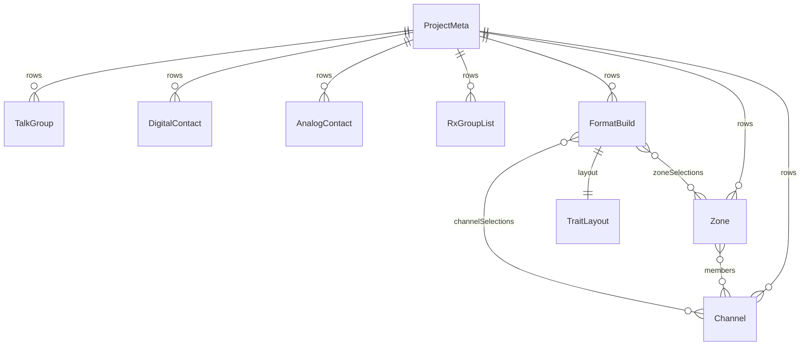

# Internal data model

Tier-1 reference for the vendor-neutral **library + format build** model. Wire-format mapping lives in future `docs/reference/<format>/` trees and import/export adapters — not here.

**Tracking:** Phase 1 [#4](https://github.com/pskillen/codeplug-studio/issues/4) · Persistence planning: [storage.md](../../poc-migration/storage.md)

**Source:** `src/core/models/`

## Overview

A **project** holds operator metadata and references many **persistable rows**: library entities (channels, zones, talk groups, contacts, RX group lists) and **format builds**. The library is the RF inventory; builds select library rows with optional per-build name overrides.

## Schema version

`STUDIO_SCHEMA_VERSION = 1` in `src/core/models/schemaVersion.ts`. Bumps when persisted row shapes change.

## Persistable rows

Every stored entity extends `PersistableRow`:

| Field       | Purpose                                     |
| ----------- | ------------------------------------------- |
| `id`        | UUID primary key                            |
| `projectId` | Owning project                              |
| `revision`  | Optimistic concurrency (integrations layer) |
| `updatedAt` | ISO timestamp                               |

See [storage.md](../../poc-migration/storage.md) — Phase 1 uses in-memory row maps; Phase 2 adds IndexedDB.

## Project metadata

`ProjectMeta` — name, description, notes, author, `createdAt`. One metadata row per project (`id === projectId`).

## Library entities

Vendor-neutral RF semantics only. UUID `id` FKs; `name` is a display label.

| Entity           | Notes                                                                    |
| ---------------- | ------------------------------------------------------------------------ |
| `Channel`        | Frequency (Hz), callsign, power, location, scan skip; `modeProfiles` (FM / DMR profiles) |
| `Zone`           | First-class grouping — `members` as channel `EntityRef[]`; export flags  |
| `TalkGroup`      | Digital group call — `mode`, `digitalId`                                 |
| `DigitalContact` | Digital private call — `mode`, `digitalId`                               |
| `AnalogContact`  | Analogue call sign / code                                                |
| `RxGroupList`    | Promiscuous RX list — `members` as talk-group `EntityRef[]`              |

Mode-specific channel fields live on `modeProfiles` entries (`ChannelModeProfileFM`, `ChannelModeProfileDMR`).

## Format build

`FormatBuild` — one CPS workflow target within a project:

| Field                   | Purpose                                                 |
| ----------------------- | ------------------------------------------------------- |
| `formatId`              | Wire format family (`opengd77`, `chirp`, `dm32`, …)     |
| `profileId`             | Trait profile key (e.g. `opengd77-1701`, `chirp-uv5r`)  |
| `channelSelections`     | Included channels + optional `overrides.name`           |
| `zoneSelections`        | Included zones + optional `overrides.name`              |
| `talkGroupSelections`   | Included talk groups                                    |
| `contactSelections`     | Included digital or analogue contacts                   |
| `rxGroupListSelections` | Included RX group lists                                 |
| `layout`                | `TraitLayout` — export projection / trait-shaped layout |

`TraitLayout` `ZoneGroupingLayout` expresses export-time ordering; library `Zone` rows are the source of truth for membership.

## Build capability traits

Declared per profile in `TRAIT_PROFILES` (`src/core/models/traits.ts`). Examples:

| Profile         | Traits                                                 |
| --------------- | ------------------------------------------------------ |
| `opengd77-1701` | zone grouping, zone-as-scan-list, multi-TG per channel |
| `dm32-default`  | zone grouping, scan lists, m×n expansion               |
| `chirp-uv5r`    | flat memory list, per-channel scan flag                |

Build UI and layout compose from traits; wire adapters map `assemble(build, library)` at export.

## Factories and validation

- `src/core/domain/factories.ts` — `newProjectMeta`, `newChannel`, `newZone`, `newFormatBuild`, …
- `src/core/domain/validation.ts` — vendor-neutral guards (non-empty names, ref targets exist)

## Implementation status

| Area                      | Status              |
| ------------------------- | ------------------- |
| Core types                | Shipped (Phase 1)   |
| `ProjectPersistence` port | Shipped — in-memory |
| IndexedDB persistence     | Phase 2             |
| Import/export adapters    | Phase 3+            |
| Library CRUD UI           | Phase 2             |

## Related

- [DESIGN.md](../../../DESIGN.md) — product constitution
- [epic-1-context.md](../../poc-migration/epic-1-context.md) — migration background
