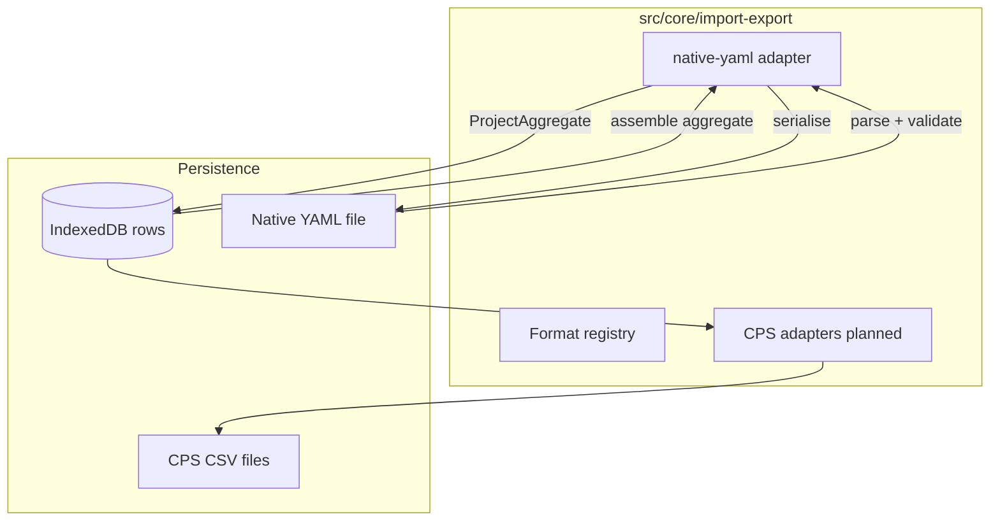

# Import / export

How external interchange files enter Codeplug Studio, become the internal [library + format build model](../data-model/README.md), and leave again as portable or CPS-ready formats.

**Tracking:** Phase 3 [#35](https://github.com/pskillen/codeplug-studio/issues/35) · Native YAML core [#56](https://github.com/pskillen/codeplug-studio/issues/56)–[#58](https://github.com/pskillen/codeplug-studio/issues/58)

**Source:** `src/core/import-export/`

## Problem

Operators need to move whole projects between browsers, backups, and (later) cloud folders without losing library entities, build layouts, or wire-name overrides. CPS CSV families (OpenGD77, CHIRP, DM32, …) are **lossy projections** at the wire boundary. **Native YAML** is Studio's own interchange — lossless for the internal model.

IndexedDB remains the **edit store**; YAML and Drive are portable layers on top (see [storage.md](../../poc-migration/storage.md)).

## Implementation status

| Area                                                    | Status      | Notes                                                                                                                                                                                                                                                                  |
| ------------------------------------------------------- | ----------- | ---------------------------------------------------------------------------------------------------------------------------------------------------------------------------------------------------------------------------------------------------------------------- |
| Adapter contracts + registry                            | Shipped     | `src/core/import-export/` — `ImportAdapter`, `ExportAdapter`, `formatCatalog`                                                                                                                                                                                          |
| Native YAML — schema + envelope                         | Shipped     | `StudioProjectDocument` v1 — [#56](https://github.com/pskillen/codeplug-studio/issues/56)                                                                                                                                                                              |
| Native YAML — export serialiser                         | Shipped     | [#57](https://github.com/pskillen/codeplug-studio/issues/57)                                                                                                                                                                                                           |
| Native YAML — import parser                             | Shipped     | [#58](https://github.com/pskillen/codeplug-studio/issues/58)                                                                                                                                                                                                           |
| Application services (`importProject`, `exportProject`) | Shipped     | [#59](https://github.com/pskillen/codeplug-studio/issues/59) — `importProjectYaml` / `exportProjectYaml`                                                                                                                                                               |
| Local file UI                                           | Shipped     | [#60](https://github.com/pskillen/codeplug-studio/issues/60) — Summary **Project interchange** (+ Home import); `/import-export` redirects to `/summary` ([#569](https://github.com/pskillen/codeplug-studio/issues/569))                                              |
| Format catalog UI (CPS placeholders)                    | Retired     | Catalog band removed with standalone Import/export page ([#569](https://github.com/pskillen/codeplug-studio/issues/569)); format discovery is **New build**                                                                                                            |
| Google Drive                                            | Shipped     | [#61](https://github.com/pskillen/codeplug-studio/issues/61)–[#62](https://github.com/pskillen/codeplug-studio/issues/62)                                                                                                                                              |
| OpenGD77 CSV export                                     | Shipped     | [#88](https://github.com/pskillen/codeplug-studio/issues/88) adapter + [#91](https://github.com/pskillen/codeplug-studio/issues/91) UI — [#95](https://github.com/pskillen/codeplug-studio/pull/95)                                                                    |
| CPS export services (`assemble`, `exportBuild`)         | Shipped     | [#86](https://github.com/pskillen/codeplug-studio/issues/86) — [cps-services.md](cps-services.md)                                                                                                                                                                      |
| Build `exportSettings` on `FormatBuild`                 | Shipped     | [#203](https://github.com/pskillen/codeplug-studio/issues/203) — name shortening, scan default, DM32 scan master; YAML round-trip                                                                                                                                      |
| OpenGD77 CSV import                                     | Planned     | Epic [#502](https://github.com/pskillen/codeplug-studio/issues/502) — [#522](https://github.com/pskillen/codeplug-studio/issues/522)–[#526](https://github.com/pskillen/codeplug-studio/issues/526)                                                                    |
| CHIRP CSV export                                        | Shipped     | Epic [#504](https://github.com/pskillen/codeplug-studio/issues/504) — [chirp/README.md](chirp/README.md); import [#222](https://github.com/pskillen/codeplug-studio/issues/222)–[#226](https://github.com/pskillen/codeplug-studio/issues/226)                         |
| DM32 CSV export                                         | Shipped     | Epic [#503](https://github.com/pskillen/codeplug-studio/issues/503) — [dm32/README.md](dm32/README.md); import [#124](https://github.com/pskillen/codeplug-studio/issues/124)–[#128](https://github.com/pskillen/codeplug-studio/issues/128)                           |
| Anytone CPS export                                      | Shipped     | Epic [#505](https://github.com/pskillen/codeplug-studio/issues/505) — AT-D890UV DMR MVP; [anytone/README.md](anytone/README.md); import [#238](https://github.com/pskillen/codeplug-studio/issues/238)–[#242](https://github.com/pskillen/codeplug-studio/issues/242)  |
| NeonPlug `.neonplug`                                    | In progress | Epic [#536](https://github.com/pskillen/codeplug-studio/issues/536) — channels + ZIP [#539](https://github.com/pskillen/codeplug-studio/issues/539); scaffold [#538](https://github.com/pskillen/codeplug-studio/issues/538); [neonplug/README.md](neonplug/README.md) |
| qDMR YAML                                               | Planned     | Out of Phase 3 scope                                                                                                                                                                                                                                                   |

## Architecture

Routes and UI call **application services** (`importProjectYaml`, `exportProjectYaml`, …) — not format adapters directly.

## Format registry

| Format        | Import  | Export  | Delivery                   |
| ------------- | ------- | ------- | -------------------------- |
| `native-yaml` | Shipped | Shipped | Single file — full project |
| `opengd77`    | Planned | Shipped | Multi-file CSV             |
| `chirp`       | Planned | Shipped | Single-file memory CSV     |
| `dm32`        | Planned | Shipped | Multi-file CSV             |
| `anytone`     | Planned | Shipped | Multi-file CSV             |
| `neonplug`    | Planned | Shipped | Single ZIP (`.neonplug`)   |
| `qdmr`        | Planned | Planned | YAML (vendor)              |

Wire mapping for CPS formats lives in `docs/reference/<format>/` — not here.

## UI (project YAML + CPS export)

**Native YAML** (project interchange) lives on **Summary** (`/summary`) under **Project interchange** — import (replace active project), download, and Google Drive save. Home still offers create-from-YAML. Bookmarks to `/import-export` redirect to `/summary`.

**CPS export** lives on each format build under **Export for radio** (`/builds` → `/builds/:id/export`) via [`ExportBuildCpsPanel`](../../../src/app/components/builds/ExportBuildCpsPanel.tsx). Format discovery for new targets is the **New build** wizard (`formatCatalog`), not a separate catalog page.

## Vendor-neutral rules

- Internal relationships use UUID `id` fields — `name` is a display or build wire label, not an FK.
- Export serialises **typed model fields** only — no wire stash or provenance replay ([export-from-model](../../../.cursor/rules/export-from-model.mdc)).
- Library CRUD and validation stay unlimited; radio caps apply at CPS export adapters only.
- CPS wire strings are normalised to **printable ASCII** at export (common Unicode punctuation replaced, remaining non-ASCII stripped). Library display names may still contain Unicode; auto-generated defaults use ASCII separators.

## Documentation map

| Doc                                                                            | Contents                                                                                                                                                                                                           |
| ------------------------------------------------------------------------------ | ------------------------------------------------------------------------------------------------------------------------------------------------------------------------------------------------------------------ |
| [adding-a-new-format.md](adding-a-new-format.md)                               | **Canonical checklist** for shipping a new CPS format ([#183](https://github.com/pskillen/codeplug-studio/issues/183))                                                                                             |
| [google-drive.md](google-drive.md)                                             | Google Drive OAuth, browser, export workflow                                                                                                                                                                       |
| [native-yaml/README.md](native-yaml/README.md)                                 | Native YAML product behaviour and code anchors                                                                                                                                                                     |
| [opengd77/README.md](opengd77/README.md)                                       | OpenGD77 profiles and adapter behaviour                                                                                                                                                                            |
| [opengd77-outstanding.md](opengd77-outstanding.md)                             | OpenGD77 debt — [#99](https://github.com/pskillen/codeplug-studio/issues/99), import [#522](https://github.com/pskillen/codeplug-studio/issues/522)–[#526](https://github.com/pskillen/codeplug-studio/issues/526) |
| [dm32/README.md](dm32/README.md)                                               | DM32 export hub                                                                                                                                                                                                    |
| [chirp/README.md](chirp/README.md)                                             | CHIRP export hub                                                                                                                                                                                                   |
| [../../reference/chirp/README.md](../../reference/chirp/README.md)             | Tier 3 — CHIRP wire tables                                                                                                                                                                                         |
| [anytone/README.md](anytone/README.md)                                         | Anytone export hub                                                                                                                                                                                                 |
| [anytone-outstanding.md](anytone-outstanding.md)                               | Anytone debt under [#505](https://github.com/pskillen/codeplug-studio/issues/505)                                                                                                                                  |
| [anytone/csv-reconciliation-gaps.md](anytone/csv-reconciliation-gaps.md)       | CSV variance history ([#297](https://github.com/pskillen/codeplug-studio/issues/297))                                                                                                                              |
| [../../reference/anytone/README.md](../../reference/anytone/README.md)         | Tier 3 — Anytone wire tables                                                                                                                                                                                       |
| [../../reference/dm32/README.md](../../reference/dm32/README.md)               | Tier 3 — DM32 wire tables                                                                                                                                                                                          |
| [neonplug/README.md](neonplug/README.md)                                       | NeonPlug product hub (channel export + ZIP shipped; org entities / import planned)                                                                                                                                 |
| [../../reference/neonplug/README.md](../../reference/neonplug/README.md)       | Tier 3 — NeonPlug `.neonplug` / `codeplug.json`                                                                                                                                                                    |
| [../../reference/native-yaml/README.md](../../reference/native-yaml/README.md) | Tier 3 — YAML field tables and example document                                                                                                                                                                    |

Format epics under [#298](https://github.com/pskillen/codeplug-studio/issues/298): [#502](https://github.com/pskillen/codeplug-studio/issues/502)–[#505](https://github.com/pskillen/codeplug-studio/issues/505), [#536](https://github.com/pskillen/codeplug-studio/issues/536) (NeonPlug). Cloud interchange: [#499](https://github.com/pskillen/codeplug-studio/issues/499).

## Related

- [data-model](../data-model/README.md) — library + format build types
- [DESIGN.md](../../../DESIGN.md) — import-first, export-as-projection principles
- [epic-1-context.md](../../poc-migration/epic-1-context.md) — migration background
