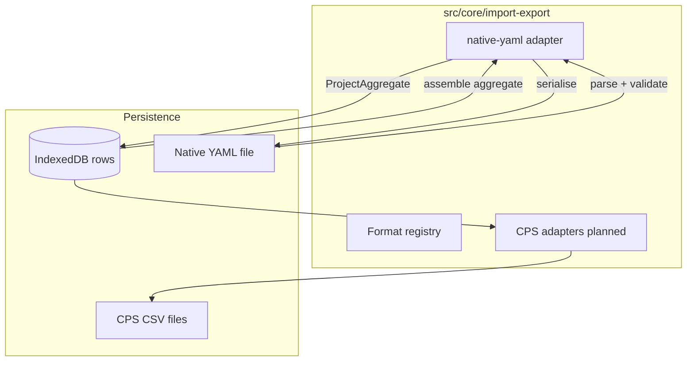

# Import / export

How external interchange files enter Codeplug Studio, become the internal [library + format build model](../data-model/README.md), and leave again as portable or CPS-ready formats.

**Tracking:** Phase 3 [#35](https://github.com/pskillen/codeplug-studio/issues/35) · Native YAML core [#56](https://github.com/pskillen/codeplug-studio/issues/56)–[#58](https://github.com/pskillen/codeplug-studio/issues/58)

**Source:** `src/core/import-export/`

## Problem

Operators need to move whole projects between browsers, backups, and (later) cloud folders without losing library entities, build layouts, or wire-name overrides. CPS CSV families (OpenGD77, CHIRP, DM32, …) are **lossy projections** at the wire boundary. **Native YAML** is Studio's own interchange — lossless for the internal model.

IndexedDB remains the **edit store**; YAML and Drive are portable layers on top (see [storage.md](../../poc-migration/storage.md)).

## Implementation status

| Area                                                    | Status  | Notes                                                                                                                     |
| ------------------------------------------------------- | ------- | ------------------------------------------------------------------------------------------------------------------------- |
| Adapter contracts + registry                            | Shipped | `src/core/import-export/` — `ImportAdapter`, `ExportAdapter`, `formatCatalog`                                             |
| Native YAML — schema + envelope                         | Shipped | `StudioProjectDocument` v1 — [#56](https://github.com/pskillen/codeplug-studio/issues/56)                                 |
| Native YAML — export serialiser                         | Shipped | [#57](https://github.com/pskillen/codeplug-studio/issues/57)                                                              |
| Native YAML — import parser                             | Shipped | [#58](https://github.com/pskillen/codeplug-studio/issues/58)                                                              |
| Application services (`importProject`, `exportProject`) | Shipped | [#59](https://github.com/pskillen/codeplug-studio/issues/59) — `importProjectYaml` / `exportProjectYaml`                  |
| Local file UI                                           | Shipped | [#60](https://github.com/pskillen/codeplug-studio/issues/60) — `/import-export`, Home import                                |
| Google Drive                                            | Planned | [#61](https://github.com/pskillen/codeplug-studio/issues/61)–[#62](https://github.com/pskillen/codeplug-studio/issues/62) |
| OpenGD77 CSV                                            | Planned | Phase 4+ — registry slot `planned`                                                                                        |
| CHIRP CSV                                               | Planned | Phase 4+                                                                                                                  |
| DM32 CSV                                                | Planned | Phase 4+                                                                                                                  |
| qDMR YAML                                               | Planned | Out of Phase 3 scope                                                                                                      |

## Architecture

Routes and UI call **application services** (`importProjectYaml`, `exportProjectYaml`, …) — not format adapters directly.

## Format registry

| Format        | Import  | Export  | Delivery                   |
| ------------- | ------- | ------- | -------------------------- |
| `native-yaml` | Shipped | Shipped | Single file — full project |
| `opengd77`    | Planned | Planned | Multi-file CSV             |
| `chirp`       | Planned | Planned | Single-file CSV            |
| `dm32`        | Planned | Planned | Multi-file CSV             |
| `qdmr`        | Planned | Planned | YAML (vendor)              |

Wire mapping for CPS formats lives in `docs/reference/<format>/` — not here.

## Vendor-neutral rules

- Internal relationships use UUID `id` fields — `name` is a display or build wire label, not an FK.
- Export serialises **typed model fields** only — no wire stash or provenance replay ([export-from-model](../../../.cursor/rules/export-from-model.mdc)).
- Library CRUD and validation stay unlimited; radio caps apply at CPS export adapters only.

## Documentation map

| Doc                                                                            | Contents                                        |
| ------------------------------------------------------------------------------ | ----------------------------------------------- |
| [native-yaml/README.md](native-yaml/README.md)                                 | Native YAML product behaviour and code anchors  |
| [native-yaml-progress.md](native-yaml-progress.md)                             | Execution log for #56–#58                       |
| [native-yaml-outstanding.md](native-yaml-outstanding.md)                       | Debt discovered during native YAML work         |
| [../../reference/native-yaml/README.md](../../reference/native-yaml/README.md) | Tier 3 — YAML field tables and example document |

## Related

- [data-model](../data-model/README.md) — library + format build types
- [DESIGN.md](../../../DESIGN.md) — import-first, export-as-projection principles
- [epic-1-context.md](../../poc-migration/epic-1-context.md) — migration background
