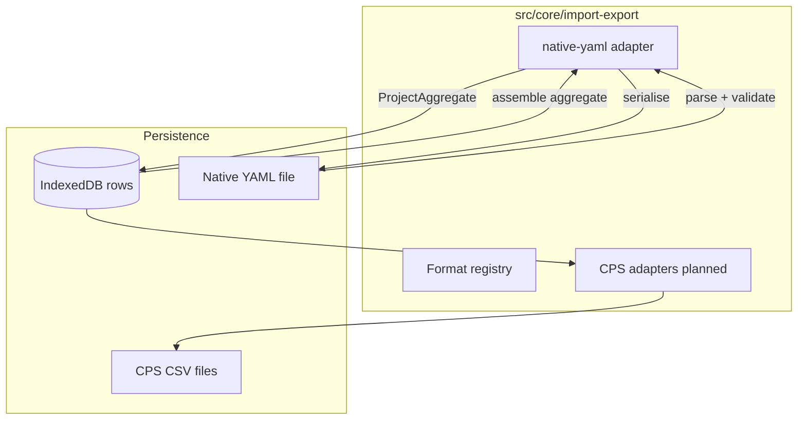

# Import / export

How external interchange files enter Codeplug Studio, become the internal [library + format build model](../data-model/README.md), and leave again as portable or CPS-ready formats.

**Tracking:** Phase 3 [#35](https://github.com/pskillen/codeplug-studio/issues/35) · Native YAML core [#56](https://github.com/pskillen/codeplug-studio/issues/56)–[#58](https://github.com/pskillen/codeplug-studio/issues/58)

**Source:** `src/core/import-export/`

## Problem

Operators need to move whole projects between browsers, backups, and (later) cloud folders without losing library entities, build layouts, or wire-name overrides. CPS CSV families (OpenGD77, CHIRP, DM32, …) are **lossy projections** at the wire boundary. **Native YAML** is Studio's own interchange — lossless for the internal model.

IndexedDB remains the **edit store**; YAML and Drive are portable layers on top (see [storage.md](../../poc-migration/storage.md)).

## Implementation status

| Area                                                    | Status      | Notes                                                                                                                                                                                               |
| ------------------------------------------------------- | ----------- | --------------------------------------------------------------------------------------------------------------------------------------------------------------------------------------------------- |
| Adapter contracts + registry                            | Shipped     | `src/core/import-export/` — `ImportAdapter`, `ExportAdapter`, `formatCatalog`                                                                                                                       |
| Native YAML — schema + envelope                         | Shipped     | `StudioProjectDocument` v1 — [#56](https://github.com/pskillen/codeplug-studio/issues/56)                                                                                                           |
| Native YAML — export serialiser                         | Shipped     | [#57](https://github.com/pskillen/codeplug-studio/issues/57)                                                                                                                                        |
| Native YAML — import parser                             | Shipped     | [#58](https://github.com/pskillen/codeplug-studio/issues/58)                                                                                                                                        |
| Application services (`importProject`, `exportProject`) | Shipped     | [#59](https://github.com/pskillen/codeplug-studio/issues/59) — `importProjectYaml` / `exportProjectYaml`                                                                                            |
| Local file UI                                           | Shipped     | [#60](https://github.com/pskillen/codeplug-studio/issues/60) — `/import-export`, Home import                                                                                                        |
| Format catalog UI (CPS placeholders)                    | Shipped     | [#83](https://github.com/pskillen/codeplug-studio/issues/83) — CPS grid + export build stub                                                                                                         |
| Google Drive                                            | Shipped     | [#61](https://github.com/pskillen/codeplug-studio/issues/61)–[#62](https://github.com/pskillen/codeplug-studio/issues/62)                                                                           |
| OpenGD77 CSV export                                     | Shipped     | [#88](https://github.com/pskillen/codeplug-studio/issues/88) adapter + [#91](https://github.com/pskillen/codeplug-studio/issues/91) UI — [#95](https://github.com/pskillen/codeplug-studio/pull/95) |
| CPS export services (`assemble`, `exportBuild`)         | Shipped     | [#86](https://github.com/pskillen/codeplug-studio/issues/86) — [cps-services.md](cps-services.md)                                                                                                   |
| OpenGD77 CSV import                                     | Planned     | Phase 4b                                                                                                                                                                                            |
| CHIRP CSV                                               | Planned     | Phase 4+                                                                                                                                                                                            |
| DM32 CSV export                                         | Shipped     | [#37](https://github.com/pskillen/codeplug-studio/issues/37) — [dm32/README.md](dm32/README.md); import [#112](https://github.com/pskillen/codeplug-studio/issues/112) planned |
| qDMR YAML                                               | Planned     | Out of Phase 3 scope                                                                                                                                                                                |

## Architecture

Routes and UI call **application services** (`importProjectYaml`, `exportProjectYaml`, …) — not format adapters directly.

## Format registry

| Format        | Import  | Export  | Delivery                   |
| ------------- | ------- | ------- | -------------------------- |
| `native-yaml` | Shipped | Shipped | Single file — full project |
| `opengd77`    | Planned | Shipped | Multi-file CSV             |
| `chirp`       | Planned | Planned | Single-file CSV            |
| `dm32`        | Planned | Shipped | Multi-file CSV             |
| `qdmr`        | Planned | Planned | YAML (vendor)              |

Wire mapping for CPS formats lives in `docs/reference/<format>/` — not here.

## UI (`/import-export`)

The import/export route is organised in three bands:

1. **Native YAML** — shipped import (replace active project) and export (download + Google Drive).
2. **CPS formats** — `CpsFormatCatalogGrid` driven by `formatCatalog`; planned formats show a “coming soon” alert ([`FormatCatalogPanel`](../../../src/app/components/import-export/FormatCatalogPanel.tsx)).
3. **Export to CPS** — pointer to **Radio builds** (`/builds`); per-build export UI lives on each build detail page ([`ExportBuildCpsPanel`](../../../src/app/components/builds/ExportBuildCpsPanel.tsx)).

Optional deep link: `?format=opengd77` highlights the matching catalog card (`useFormatParam`).

## Vendor-neutral rules

- Internal relationships use UUID `id` fields — `name` is a display or build wire label, not an FK.
- Export serialises **typed model fields** only — no wire stash or provenance replay ([export-from-model](../../../.cursor/rules/export-from-model.mdc)).
- Library CRUD and validation stay unlimited; radio caps apply at CPS export adapters only.
- CPS wire strings are normalised to **printable ASCII** at export (common Unicode punctuation replaced, remaining non-ASCII stripped). Library display names may still contain Unicode; auto-generated defaults use ASCII separators.

## Documentation map

| Doc                                                                            | Contents                                                                         |
| ------------------------------------------------------------------------------ | -------------------------------------------------------------------------------- |
| [google-drive.md](google-drive.md)                                             | Google Drive OAuth, browser, export workflow                                     |
| [native-yaml/README.md](native-yaml/README.md)                                 | Native YAML product behaviour and code anchors                                   |
| [native-yaml-progress.md](native-yaml-progress.md)                             | Execution log for #56–#58                                                        |
| [native-yaml-outstanding.md](native-yaml-outstanding.md)                       | Debt discovered during native YAML work                                          |
| [opengd77/README.md](opengd77/README.md)                                       | OpenGD77 profiles and adapter behaviour                                          |
| [opengd77-progress.md](opengd77-progress.md)                                   | Phase 4a execution log                                                           |
| [opengd77-outstanding.md](opengd77-outstanding.md)                             | OpenGD77 debt and deferrals                                                      |
| [dm32/README.md](dm32/README.md)                                               | DM32 export hub ([#113](https://github.com/pskillen/codeplug-studio/issues/113)) |
| [dm32-progress.md](dm32-progress.md)                                           | Epic #37 DM32 export execution log                                               |
| [dm32-outstanding.md](dm32-outstanding.md)                                     | DM32 export debt and deferrals                                                   |
| [../../reference/dm32/README.md](../../reference/dm32/README.md)               | Tier 3 — DM32 wire tables                                                        |
| [../../reference/native-yaml/README.md](../../reference/native-yaml/README.md) | Tier 3 — YAML field tables and example document                                  |

## Related

- [data-model](../data-model/README.md) — library + format build types
- [DESIGN.md](../../../DESIGN.md) — import-first, export-as-projection principles
- [epic-1-context.md](../../poc-migration/epic-1-context.md) — migration background
