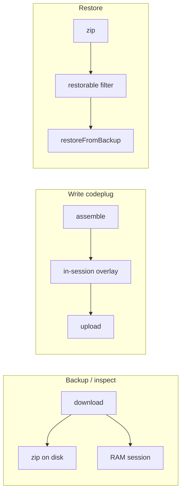

# Radio backup + restore

How operators snapshot a connected radio to a local zip, inspect that zip offline, and replay captured memory onto the same physical radio — without storing the image on the project and without running Write-codeplug (`assemble`).

Per-radio restorable vs inspect-only region tables, coverage honesty, and protocol skip lists belong under [`docs/reference/radios/<manufacturer>/<model>/`](../../reference/radios/), not in this file.

**Tracking:** epic [#1136](https://github.com/pskillen/codeplug-studio/issues/1136) (parent [#594](https://github.com/pskillen/codeplug-studio/issues/594)). Hub status stays in the [radio-read-write README](README.md).

## Implementation status

| Area                                          | Status   | Notes                                                                                                                                                                                                                        |
| --------------------------------------------- | -------- | ---------------------------------------------------------------------------------------------------------------------------------------------------------------------------------------------------------------------------- |
| Strip tab `/builds/:id/backup`                | Shipped  | After Satellite keps (when present), before About; shown when the build has a Web Serial egress.                                                                                                                             |
| Live backup → auto-download zip + RAM inspect | Shipped  | [#1138](https://github.com/pskillen/codeplug-studio/issues/1138) — zip first, then page fill; leaving the tab discards RAM.                                                                                                  |
| Rich inspect lists                            | Shipped  | [#1139](https://github.com/pskillen/codeplug-studio/issues/1139) — expandable on-image channel / zone / list names; not write coverage. Inspect-only regions stay listed and are not restore targets.                        |
| Open backup file                              | Shipped  | Offline parse of v1 archives. Radio Info `hydration.json` zips are not imported.                                                                                                                                             |
| Restore to radio                              | Plumbing | [#1140](https://github.com/pskillen/codeplug-studio/issues/1140) — identity, region filter, confirm UI. Restore stays disabled until that radio’s protocol implements `restoreFromBackup`. Serial mismatch is a hard refuse. |
| Per-radio restorable vs inspect-only maps     | Design   | Exact restore sections stay in this contract until each family’s restore PR; radio reference docs get the tables then.                                                                                                       |

---

## Problem

Studio is removing **persisted radio-clone hydration** from the project (`EgressPath.hydration` / `RadioCloneHydrationBag`). That stash was unsafe as a Write base (wrong radio, stale session) and is being deleted on purpose.

It was also the only **1-click recovery** after a bad Web Serial write: a prior Read sat on the egress, and Write merged the current build onto those bytes. Dropping stash without a replacement leaves operators with vendor CPS only.

**Radio Info** (`/builds/:id/radio-info`) already inspects a live read in RAM and can dump a debug zip of the hydration bag. That zip is not a restore format, and inspect lived under About — easy to miss before a risky write.

Backup / Restore is the spare tyre: a **file the operator owns**, plus a restore path that is **not** “Write this build.”

---

## Vocabulary

| Term                    | Meaning                                                                                                                                                                                                  |
| ----------------------- | -------------------------------------------------------------------------------------------------------------------------------------------------------------------------------------------------------- |
| **Write codeplug**      | Export-tab Web Serial write: modelled build overlay + in-session co-resident bytes. Uses `assemble` / `prepareRadioWriteImage` / `upload`.                                                               |
| **Backup**              | Connect → `download()` (full-as-possible read) → versioned zip on disk **and** in-RAM session.                                                                                                           |
| **Restore**             | Replay **restorable** archive bytes onto a matching radio. Not assemble.                                                                                                                                 |
| **Radio Info**          | Former About-child inspect page. Replaced by this tab; old URLs redirect here.                                                                                                                           |
| **Hydration bag**       | `RadioCloneHydrationBag` — project/egress stash type. May be built **ephemerally in RAM** so existing clone-summary / decode helpers can render. Must not be the zip contract and must not be persisted. |
| **Restorable region**   | Named memory span Restore may send.                                                                                                                                                                      |
| **Inspect-only region** | Named span kept in the zip for diagnostics (LocalInfo, calibration, extra FLASH). Restore never writes it.                                                                                               |

---

## Three compositions (isolation)

Share protocol `CloneImageRadio.download` and low-level read helpers. **Do not** share Write upload-staging (`seedProtocolForUpload` from a bag, `prepareRadioWriteImage`, D890 encode-from-build onto cache).



| Composition      | Persist                       | `assemble`? | Feeds Write-codeplug? |
| ---------------- | ----------------------------- | ----------- | --------------------- |
| Backup / inspect | Optional zip only             | No          | No                    |
| Pre-write read   | RAM, same connection as Write | Overlay yes | Yes                   |
| Restore          | Zip → radio                   | No          | No                    |

Leaving the Backup / Restore page discards the RAM session. The zip on disk is the durable copy. Restore opens a **new** serial connection (backup already closed after read).

---

## Placement in the UI

Still **per-build** because that is the only radio I/O door today (egress + descriptor). The **file is not owned by the build**. A radio-level UI can come later.

**Strip tab:** **Backup / Restore**, after Satellite keps (when present), before About. Shown when the build has a Web Serial egress (`findRadioIoEgress`).

**Route:** `/builds/:id/backup`. `/radio-info` and `/radio-image` redirect here.

**Not on the Export tab.** Optional one-line link from the write panel (“Back up this radio first”) is fine; Restore must not live next to Write-codeplug.

`gtag` page_view on `/builds/:id/backup` is allowed (analytics templates). **No telemetry of zip contents.**

---

## Operator workflows

### Empty page

Two actions:

| Action               | When                    | What                                                                          |
| -------------------- | ----------------------- | ----------------------------------------------------------------------------- |
| **Backup radio**     | Web Serial + descriptor | Connect → read → **auto-download zip** → populate RAM session → close session |
| **Open backup file** | Always                  | File picker → parse zip → same inspect UI; no serial until Restore            |

Copy: this is not Write; the zip stays on the operator’s disk; the file may contain contact banks / callsigns.

For radios whose restore depends on a live address map (DM-32): **warn at backup** that restore will not work after a factory reset. A factory-reset radio is already in a working state; remapping is out of scope.

### Backup radio (live)

1. Request a serial port (`openRadioSessionForEgress`, purpose `read`, force port selection).
2. `session.radio.download()` — existing clone download.
3. Pack `manifest.json` + one bin per named region.
4. **`downloadZip` immediately.** Having a file is the primary success; filling the page is secondary.
5. Keep an in-memory session; progress uses the existing radio-io modal as a **read**.
6. Close the session. Restore will connect again.

Filename: `radio-backup-<modelId>-<stamp>.zip`.

### Open backup file

Unzip → validate `format` + `version` → reconstruct image / sparse regions → same RAM session. Offline. Invalid or unsupported version → error, empty page.

Do **not** import old Radio Info debug zips (`hydration.json`). None are expected in the wild.

### Populated page

1. **Restore to radio** at the top (dangerous primary). Disabled until that adapter implements restore, with copy that backup/inspect is available.
2. Identity + **coverage honesty** (see archive).
3. Region table: restorable vs inspect-only. Restore defaults to **all restorable** regions; the operator may uncheck restorable rows. Inspect-only rows cannot be enabled. The service drops inspect-only even if the UI is tampered.
4. Inspect body: **what is on this image**, not “written from your build.” Occupancy plus **expandable** channel / zone / scan / talk-group / contact lists where codecs already exist. D890 Local info / optional settings / APRS / alarm stay collapsed read-only forensics. Inspect-only regions remain in the region table and are not restore targets.
5. Secondary: save zip again / clear / read again.

Write-coverage tables stay on the **Export** write panel. They must not become the lead copy here.

### Restore

Confirm modal: connected model + serial (or firmware / label when the archive has no serial). **Serial mismatch is an error, not a confirm option.**

Progress modal operation **`restore`** — copy must not say “Writing codeplug.” Abort / disconnect like other radio-io flows.

Optional post-restore verify where the descriptor already has `writeVerify` (same idea as Write). Not a blocker for families without hooks.

---

## Archive format (Studio contract)

This is **our** zip, not a CPS format. Pack/parse live in `src/integrations/radio-io/backup/` (no React, no IndexedDB, no `RadioBuild`). UI must not parse zip entries ad hoc.

Prefer **one bin per named memory region** (zip compresses well). A single contiguous `memory.bin` is only a fallback when the adapter truly has one clone with no region map.

```text
radio-backup-<modelId>-<stamp>.zip
  manifest.json
  regions/
    channels.bin
    zones.bin
    local-info.bin       # diagnostics; restoreRole: inspect-only
    calibration.bin      # when the radio has an isolated cal table; inspect-only
    …
```

```ts
type RadioBackupRegionRole = 'restorable' | 'inspect-only';

interface RadioBackupRegionV1 {
  id: string; // stable, e.g. 'channels' | 'local-info' | 'calibration'
  label: string;
  address: number;
  byteLength: number;
  path: string; // zip path under regions/
  restoreRole: RadioBackupRegionRole;
}

interface RadioBackupManifestV1 {
  format: 'codeplug-studio-radio-backup';
  version: 1;
  capturedAt: string; // ISO
  capturedVia: 'web-serial' | 'file';
  app: { buildEnv: string; buildVersion: string }; // __BUILD_ENV__ / __BUILD_VERSION__
  radioModelId: string; // descriptor.modelIds[0]
  descriptorLabel: string;
  firmware?: string;
  serial?: string; // when the adapter can read one
  coverage: 'full-clone' | 'known-map-regions' | 'partial';
  imageByteLength: number;
  regions: RadioBackupRegionV1[];
  restoreFragileAfterFactoryReset?: boolean;
  addressBase?: number;
  dm32ContactsBase?: number;
  dm32ContactsEnd?: number;
}
```

Reject unknown `format` / `version`, missing manifest, missing or truncated region bins.

**Backup ⊇ restore.** Capturing LocalInfo, calibration, or extra FLASH is useful after a brick even when Restore will not send those bytes. Huge contact banks (D890-scale, tens of mebibytes) stay **out** of backup unless we already download them for inspect — do not start dumping contact FLASH.

**Coverage honesty:** adapters must not claim a chip dump when they only read a known map or a CHIRP-sized programming image. Small clones may be labelled `full-clone` **of the programming image**, not of the whole flash. Exact maps: radio reference docs.

v1 only at ship. No project schema bump. Archives are never stored in IndexedDB or YAML.

---

## In-memory session

React page state only (same lifetime as today’s Radio Info bag):

```ts
type RadioBackupSession = {
  source: 'live-read' | 'file';
  manifest: RadioBackupManifestV1;
  image: MemoryMap; // or sparse cache reconstructed to MemoryMap
  inspectBag?: RadioCloneHydrationBag; // RAM-only, for existing summarise/decode UI
};
```

Build `inspectBag` with `descriptor.hydration.extractHydration(image, { protocol })` after a live read, or an equivalent reconstruct-from-blocks helper after file open. **Never** `persistBuild`.

---

## Restore guards (locked)

1. Connected `descriptor.modelIds` must include `manifest.radioModelId`.
2. If `manifest.serial` is non-empty, live serial must match or restore is **refused**. Operator confirm is only “this is the same radio we already matched,” not a bypass.
3. If the family has no serial in the archive: model match + confirm showing firmware / label.
4. Write **only** `restoreRole: 'restorable'` regions. Never LocalInfo. Never calibration. Still honour each radio’s existing unsafe skip-write addresses (see that radio’s protocol docs).
5. If `restoreFragileAfterFactoryReset` and live discovery bases ≠ manifest: **refuse**. Remap is out of scope.
6. If the protocol has no `restoreFromBackup`: inspect only; Restore stays disabled.
7. Do **not** gate Restore on vestigial `prodWriteDisabled` (no adapter sets it). Deleting that flag is not this feature.

**Must not** call: `assemble()`, `buildRadioWriteProjection`, `prepareRadioWriteImage`, `mergeChannelsIntoHydration`, or D890 encode/assemble-from-build helpers.

App entry: `src/app/services/radioBackupRestore.ts` — a sibling of write session code, not a branch inside `prepareRadioWriteImage`.

Protocol hook (placement: `CloneImageRadio` preferred so restore can use the live pipe):

```ts
restoreFromBackup?(
  archive: { manifest: RadioBackupManifestV1; image: MemoryMap },
  opts: {
    regionIds: readonly string[];
    onProgress?: ProgressFn;
    signal?: AbortSignal;
  },
): Promise<void>;
```

---

## Per-family behaviour (conceptual)

Write-codeplug overlay semantics stay as they are. Restore is a **sibling** of `upload`, not a flag on Write.

Exact region-role tables ship in each radio’s reference docs when that adapter’s restore lands. Rules that must hold:

| Family                      | Backup                                                                                                                           | Restore                                                                                                                                                                                                                                                                            |
| --------------------------- | -------------------------------------------------------------------------------------------------------------------------------- | ---------------------------------------------------------------------------------------------------------------------------------------------------------------------------------------------------------------------------------------------------------------------------------- |
| AT-D890UV                   | Sparse known-map regions, including LocalInfo for diagnostics. Not the huge digital-contact FLASH. Coverage `known-map-regions`. | Erase-unit RMW of restorable codeplug-shaped regions (channels, zones, scan, talk groups, RX lists, optional settings, APRS, …) onto a **fresh live read** of those units — never a virgin blank map. Omit LocalInfo and calibration. Keep the existing unsafe skip-write address. |
| OpenGD77 (DM-1701, MD-9600) | Named FLASH spans.                                                                                                               | Replay archive FLASH; force dirty vs empty/blank prior (not vs live, and not vs an armed write projection). Then **SAVE_REBOOT**, same as today’s upload.                                                                                                                          |
| UV-5R Mini / UV-21 Pro V2   | CHIRP-sized programming clone (named MEM regions). No isolated cal table in Studio’s layout.                                     | `upload` of that programming clone. Residual: if the vendor hid cal inside those spans, we do not isolate it — document that; do not invent offsets. Write-codeplug may still require project stash until a later series drops it.                                                 |
| DM-32UV                     | Sparse blocks including isolated calibration (inspect-only) plus V-frame bases in the manifest.                                  | Restorable blocks only. Live address/contact bases ≠ manifest → refuse. Warn at backup about factory reset. Write-codeplug may still stash.                                                                                                                                        |
| RT95                        | Small programming clone. No serial in layout.                                                                                    | Clone `upload`. Model + firmware confirm. Write-codeplug may still stash.                                                                                                                                                                                                          |

**i002 lesson (D890 Write):** encoding modelled bytes onto a blank map bricks the radio. Restore must overlay archive bytes on **this session’s live units**, not fill blank flash. That lesson is about the radio’s erase-unit behaviour, not about bringing stash back.

Do not combine “add restore” with “drop Write stash” in one change. Remaining stash-for-write families keep their Write path until the parked ephemeral-radio-info work resumes — after D890 restore is hardware-safe.

---

## Identity

Reuse the same live serial helpers Write already uses on D890 (LocalInfo). Persist serial **in the zip** at backup time. Restore compares **file vs live**.

This is the opposite of removing stash-vs-live checks on **Write**. Restore needs a file-vs-live check because the file is the other session.

Do not revive stash-vs-live asserts against project hydration.

---

## Privacy

In-app warning that the zip can contain contact banks and callsigns. Filename is operator-visible. No analytics of zip contents.

---

## Layers and vendor boundary

This feature is **radio-io memory**, not library or build modelling.

| May                                                                                         | Must not                                                         |
| ------------------------------------------------------------------------------------------- | ---------------------------------------------------------------- |
| `src/integrations/radio-io/backup/`, radio protocol `restoreFromBackup`, app route/services | `RadioBuild` / library entities / IndexedDB as the store         |
| Ephemeral RAM bag for inspect decode                                                        | Persist `radio-clone` hydration for backup                       |
| Named region ids in the Studio zip                                                          | CPS column names, OpenGD77-shaped library zones, name-string FKs |

Internal relationships stay UUID-based in the library. Backup files key radios by descriptor `radioModelId` + optional serial — that is an **external identity**, not a library FK.

---

## Planned code anchors

| Layer       | Path                                          | Role                                           |
| ----------- | --------------------------------------------- | ---------------------------------------------- |
| Archive     | `src/integrations/radio-io/backup/`           | Manifest types, pack, parse, validate          |
| Protocol    | `CloneImageRadio.restoreFromBackup`           | Per-radio replay beside `upload`               |
| App service | `src/app/services/radioBackupRestore.ts`      | Identity, region filter, progress; no assemble |
| UI          | `BuildRadioBackupPage` (`/builds/:id/backup`) | Empty / inspect / restore                      |
| Inspect     | `RadioCloneSummaryView` (inspect variant)     | On-image lists                                 |
| Progress    | `RadioIoProgressModal` `operation: 'restore'` | Distinct from Write                            |
| Download    | `downloadZip` / `isoTimestampForFilename`     | Auto-download backup                           |
| Retired     | `BuildRadioInfoPage`, `radioInfoExport.ts`    | Redirect / replace                             |

---

## What this is not

- Not a substitute for modelled Write (operators still curate the library and write a build).
- Not importing backup channels into the library.
- Not NeonPlug donor retain or CPS file donors.
- Not cloud / Drive auto-upload (the operator may copy the zip themselves).
- Not dumping D890-scale contact FLASH.
- Not remapping DM-32 after factory reset.
- Not deleting the unused `prodWriteDisabled` flag.

---

## Manual verify (once shipped)

1. On a healthy radio: Backup / Restore → **Backup radio** → zip in Downloads; page fills; project YAML unchanged.
2. Leave the page and return — session gone; **Open backup file** restores inspect offline.
3. Restore to the **same** radio → boots; inspect-only identity/cal regions unchanged vs the zip.
4. Attempt restore with a mismatched serial (or a zip from another unit) → refused before protocol write.
5. Confirm Export **Write** still uses assemble + in-session overlay (or stash, on unmigrated families) and does not read the backup zip.

Hardware verify is part of shipping each family’s restore, not a docs footnote.

---

## Related

- Hub: [radio-read-write README](README.md).
- Adapter checklist: [adding-a-radio-adapter.md](adding-a-radio-adapter.md) (backup region roles + `restoreFromBackup`).
- Write verify (optional after restore): [write-verify.md](write-verify.md).
- Radio protocol / coverage: `docs/reference/radios/<manufacturer>/<model>/`.
- Stash removal: [#874](https://github.com/pskillen/codeplug-studio/issues/874). Radio Info absorbed: [#876](https://github.com/pskillen/codeplug-studio/issues/876).
