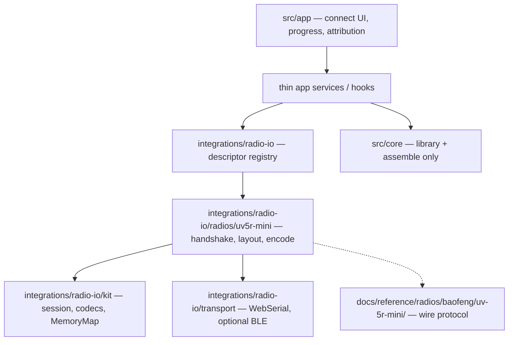

# Protocol kit architecture (WebSerial spike)

**Purpose:** Document recommended module boundaries and TypeScript shapes for reusable browser radio I/O. Originated as the [#603](https://github.com/pskillen/codeplug-studio/issues/603) spike deliverable; transport + kit core are now implemented under `src/integrations/radio-io/` ([#615](https://github.com/pskillen/codeplug-studio/issues/615), [#616](https://github.com/pskillen/codeplug-studio/issues/616)).

**Hub:** [radio-read-write/README.md](README.md) · **Epic:** [#594](https://github.com/pskillen/codeplug-studio/issues/594)

**Ground truth:**

| Source                                                                             | Role                                                                                   |
| ---------------------------------------------------------------------------------- | -------------------------------------------------------------------------------------- |
| NeonPlug [`src/radios/`](https://github.com/infamy/NeonPlug/tree/main/src/radios)  | Descriptor registry, `BaseSerialConnection`, UV5R-Mini / FT-65 / DM-32 implementations |
| CHIRP [`chirp/drivers/`](https://github.com/kk7ds/chirp/tree/master/chirp/drivers) | Clone-image lifecycle, codec families, `UV5RMini` in `baofeng_uv17Pro.py`              |
| Studio [DESIGN.md](../../../DESIGN.md)                                             | Intentional Web Serial goal; library stays vendor-neutral                              |

---

## 1. Layer diagram and dependency rules



| Layer                                    | Owns                                                                                                                                | Must not own                       |
| ---------------------------------------- | ----------------------------------------------------------------------------------------------------------------------------------- | ---------------------------------- |
| `src/integrations/radio-io/transport/`   | Web Serial port request, baud, buffered `readExact` / `write`, timeout; optional BLE GATT adapter with the same byte-stream surface | Radio handshake, memory layout     |
| `src/integrations/radio-io/kit/`         | Session lifecycle + progress (`AbortSignal`), pluggable codecs, `MemoryMap`, ACK helpers, typed radio errors                        | DOM APIs; library Channel CRUD     |
| `src/integrations/radio-io/radios/<id>/` | Descriptor, ident/handshake, memory regions, image ↔ channel decode, firmware string parse, write ranges                            | React; importing library mutations |
| `src/integrations/radio-io/` registry    | Descriptor list → factory, capabilities, picker metadata                                                                            | Per-radio framing details          |
| `src/app/`                               | Operator connect / read / write chrome, progress, in-flow attribution                                                               | Frame bytes, CPS column names      |
| `src/core/`                              | Library + build `assemble` feeding write payloads                                                                                   | Web Serial, binary protocol        |
| `docs/reference/<family>/`               | Tier-3 protocol / memory tables                                                                                                     | Product workflow prose             |

**Dependency direction (unchanged):** `app` → `core`; `integrations` → `core`. Never `core` → `app` or `core` → `integrations`. Radio-io may call `assemble` results via **app services** that pull from core — protocol modules receive already-assembled channel lists / images, not React stores.

**Why not `src/core/` for codecs?** Pure `Uint8Array` codecs could live in core, but epic [#594](https://github.com/pskillen/codeplug-studio/issues/594) places binary protocols in **integrations / tier-3**. Keeping the whole kit under `integrations/radio-io/` avoids a second home and keeps vendor binary detail out of the library model tree. File CPS adapters stay in `src/core/import-export/formats/` — sibling concern, not the same modules.

---

## 2. Generic kit surface (proposed TypeScript shapes)

Names match the shipped modules under `src/integrations/radio-io/`.

```ts
/** Browser-agnostic byte pipe — Web Serial and BLE both implement this. */
interface BytePipe {
  readonly baudRate?: number;
  write(data: Uint8Array): Promise<void>;
  /** Block until `n` bytes or throw typed timeout / closed errors. */
  readExact(n: number, timeoutMs: number): Promise<Uint8Array>;
  flush?(): Promise<void>;
  close(): Promise<void>;
}

interface ProgressUpdate {
  cur: number;
  max: number;
  msg: string;
}

type ProgressFn = (p: ProgressUpdate) => void;

interface IdentResult {
  raw: Uint8Array;
  firmwareHint?: string;
  modelHints?: string[];
}

/** Pluggable wire framing — not radio-specific memory layout. */
interface BlockCodec {
  readonly name: string;
  makeReadFrame(addr: number, length: number): Uint8Array;
  makeWriteFrame(addr: number, length: number, payload: Uint8Array): Uint8Array;
  parseReadReply?(frame: Uint8Array): Uint8Array; // strip header → payload
}

interface RadioCapabilities {
  maxChannels: number;
  supportsZones: boolean;
  supportsScanLists: boolean;
  analogOnly: boolean;
  supportsBle?: boolean;
  supportsBulkRead?: boolean;
  // …extend with flags; UI gates on these, never instanceof concrete radios
}

interface RadioDescriptor {
  modelIds: readonly string[];
  label: string;
  group?: string; // e.g. "Baofeng", "Yaesu"
  supportsBle: boolean;
  protocolFactory: () => CloneImageRadio;
  capabilities: RadioCapabilities;
  attributionIds: readonly string[]; // keys into Studio attributions lib
}

/**
 * Clone-image radio: download fills a MemoryMap; decode offline;
 * upload writes ranges (often after re-ident).
 */
interface CloneImageRadio {
  connect(pipe: BytePipe, opts?: { signal?: AbortSignal }): Promise<IdentResult>;
  disconnect(): Promise<void>;
  download(opts: { onProgress?: ProgressFn; signal?: AbortSignal }): Promise<MemoryMap>;
  upload(image: MemoryMap, opts: { onProgress?: ProgressFn; signal?: AbortSignal }): Promise<void>;
  decodeChannels(image: MemoryMap): /* Studio-facing channel DTOs */ unknown[];
  encodeChannels(image: MemoryMap, channels: /* assembled channels */ unknown[]): MemoryMap;
  readFirmware(image: MemoryMap): string | undefined;
}

interface RadioSession {
  readonly descriptor: RadioDescriptor;
  readonly pipe: BytePipe;
  readonly radio: CloneImageRadio;
  /** Optional cached image so settings survive partial rewrite (FT / UV5R pattern). */
  cachedImage?: MemoryMap;
}
```

| Shape             | NeonPlug analogue                         | CHIRP analogue                        |
| ----------------- | ----------------------------------------- | ------------------------------------- |
| `BytePipe`        | `SerialLikePort` + `BaseSerialConnection` | pyserial `pipe`                       |
| `ProgressFn`      | `onProgress` on protocol                  | `Status` + `status_fn`                |
| `BlockCodec`      | per-radio frame builders                  | `_make_frame` / family commons        |
| `RadioDescriptor` | `RadioDescriptor` in `radios/types.ts`    | `@directory.register` + class attrs   |
| `CloneImageRadio` | protocol class + connection               | `CloneModeRadio.sync_in` / `sync_out` |
| `MemoryMap`       | assembled `Uint8Array` image              | `MemoryMapBytes` + `bitwise`          |

---

## 3. Codec taxonomy

“Clone image” is the **storage model**. Wire **codecs** differ by family:

| Codec                              | Wire idea                                                            | Studio status                                              | Anchors                                                                  |
| ---------------------------------- | -------------------------------------------------------------------- | ---------------------------------------------------------- | ------------------------------------------------------------------------ |
| **PROGRAM + R/W**                  | Ident string → `R`/`W` blocks + ACK `0x06`                           | **Shipped** `#616` (`BlockCodec`) — UV-5R Mini path        | CHIRP `baofeng_uv17Pro.py`; NeonPlug `uv5rmini/baofengProtocol.ts`       |
| **V-probe**                        | `0x56` (“V”) + u32 BE param; typed variable reply                    | **Shipped** `#630` (**sibling surface**, not `BlockCodec`) | CHIRP `baofeng_uv17.py`; NeonPlug `dm32uv/`                              |
| **OpenGD77 / OpenUV380 serial**    | ASCII `C`/`R`/`W`/`X` (Command/Read/Write GD-77 / Write UV380)       | **Shipped** `#631` (**sibling surface**, not `BlockCodec`) | qdmr `opengd77_interface`; [opengd77/protocol.md](../../reference/radios/opengd77/protocol.md) |
| **S/X blocks**                     | Magic ident → `S`/`X` frames                                         | Deferred — classic UV-5R                                   | CHIRP `baofeng_common.py`, `uv5r.py`                                     |
| **Stream clone**                   | Contiguous dump + ACK, echo-strip                                    | Later — Yaesu FT-65 family                                 | CHIRP `yaesu_clone.py`; NeonPlug `ft65/`                                 |
| **ICF frames**                     | `\xFE\xFE`…`\xFD`                                                    | Out of MVP                                                 | CHIRP `icf.py`                                                           |
| **Kenwood PROGRAM + R/W/Z**        | `PROGRAM` then framed blocks                                         | Out of MVP                                                 | CHIRP `tk760g.py` et al.                                                 |

**Surface choice:** only PROGRAM+R/W implements `BlockCodec` (addr/length R/W). V-probe has no write and is not block-shaped; OpenGD77 needs mem-region codes, multi-step flash writes, and dual ACK semantics — both are dedicated sibling modules under `kit/codecs/`.

**Spike decision (historical):** implement **PROGRAM + R/W** first. Do **not** shape the kit around DM-32’s V-frame + 4KB block discovery (discovery stays in radio modules). Add **S/X** when classic UV-5R direct-write is scheduled.

---

## 4. Brand / model / variant / firmware

| Concern              | Recommendation                                                                                                                                                                                                                         |
| -------------------- | -------------------------------------------------------------------------------------------------------------------------------------------------------------------------------------------------------------------------------------- |
| **Registration**     | One `RadioDescriptor` per protocol family entry; `modelIds: string[]` maps marketing names to one factory (NeonPlug pattern).                                                                                                          |
| **Family variants**  | Prefer one protocol class with constructor params (id prefixes, offset factor, max name length) — NeonPlug FT-65 / FT-4 / FT-25. Avoid copy-paste subclasses unless layout diverges.                                                   |
| **Ident**            | Sequencer: flush → try magics → fingerprint → follow-up magics → `IdentResult`. Wrong magic → typed error pointing at the correct Studio radio (CHIRP `IDENT_BLACKLIST` idea).                                                         |
| **Detect vs picker** | MVP: operator picks model, then ident validates. Optional `detectFromSerial` later (CHIRP `DetectableInterface`) for ambiguous cables.                                                                                                 |
| **Firmware**         | Parse from image offset or V-frame string inside the **radio module**. Gate **writes** against the supported catalog ([#613](https://github.com/pskillen/codeplug-studio/issues/613)) — do not add free-text version fields on builds. |
| **CPS vs firmware**  | CPS version scopes **file** adapters; firmware scopes **direct-write** (DESIGN.md).                                                                                                                                                    |

---

## 5. Session vs image lifecycle

```text
requestPort(baud) → open BytePipe
  → radio.connect(pipe)           // ident / handshake
  → radio.download(onProgress)    // fill MemoryMap via BlockCodec
  → cache image on RadioSession
  → radio.decodeChannels(image)   // → DTOs → app maps into library / build
  → (edit in Studio)
  → assemble build → encode into cached image
  → radio.upload(image)           // often re-handshake; write ranges only
  → disconnect
```

| Rule                                                                   | Why                                                                  |
| ---------------------------------------------------------------------- | -------------------------------------------------------------------- |
| Cache full image before write                                          | Settings / DTMF / non-channel regions survive (FT-65 / UV5R pattern) |
| Upload by **ranges**, not blind full mmap when firmware restricts      | CHIRP UV-5R `_ranges_*`; safer on partial-support firmware           |
| Progress + `AbortSignal` on download/upload                            | Cancel mid-clone without orphaning the port                          |
| Separate read-handshake vs upload-handshake when the radio requires it | NeonPlug UV5R-Mini `handshakeUpload()`                               |

---

## 6. First radio: UV-5R Mini

| Item               | Value                                                                                            |
| ------------------ | ------------------------------------------------------------------------------------------------ |
| Studio module path | `src/integrations/radio-io/radios/uv5r-mini/`                                                    |
| Baud               | 38400 (NeonPlug)                                                                                 |
| Ident              | `PROGRAMCOLORPROU` (`MSTRING_UV17PROGPS`)                                                        |
| Framing            | PROGRAM + R/W; optional payload XOR crypt                                                        |
| Image size         | `MEM_TOTAL = 0x8240`; multi-region `MEM_STARTS` / `MEM_SIZES`                                    |
| Channels           | Up to 999 (CHIRP)                                                                                |
| BLE                | Optional later — same framing, larger upload block (`BLE_UP_BLOCK_SIZE = 0x80`)                  |
| Tier-3 stub        | [docs/reference/radios/baofeng/uv-5r-mini/](../../reference/radios/baofeng/uv-5r-mini/README.md) |

**Ground-truth files:**

- NeonPlug: `src/radios/uv5rmini/` (`baofengProtocol.ts`, `serialConnection.ts`, `protocol.ts`, `channelFormat.ts`)
- CHIRP: `chirp/drivers/baofeng_uv17Pro.py` — class `UV5RMini(UV17Pro)`

Classic **UV-5R** uses **S/X**, not this path — do not merge the two into one “Baofeng” codec.

---

## 7. Testing strategy

| Layer                  | Approach                                                                                   |
| ---------------------- | ------------------------------------------------------------------------------------------ |
| Kit codecs + MemoryMap | Unit tests with fixture byte arrays; mocked `BytePipe` recording writes / scripted reads   |
| Radio decode/encode    | Golden clone images (from CHIRP `tests/images/` or NeonPlug captures) — no hardware        |
| Transport              | Thin adapter tests behind a fake `SerialPort`; manual Web Serial verify on real UV-5R Mini |
| App chrome             | Component tests with fake `CloneImageRadio`; no real port                                  |

Do **not** gate CI on physical radios. Prefer per-direction tests (download decode vs upload encode) over round-trip-only gates — same principle as CPS import/export in DESIGN.md.

---

## 8. Attribution

Every radio module and any connect/write UI must credit reverse-engineering lineages ([#597](https://github.com/pskillen/codeplug-studio/issues/597)):

- `RadioDescriptor.attributionIds` → `/attributions` entries (CHIRP, NeonPlug)
- In-flow short thanks when direct-write UI ships (stubs already on `/attributions`)

Protocol code comments should cite the CHIRP driver module and NeonPlug radio folder used as ground truth.

---

## 9. Anti-patterns (do not copy)

From NeonPlug lessons and CHIRP scale:

1. **God protocol class** — DM-32-sized files mixing port UX, handshake, cache, parse, diagnostics
2. **Duplicated port openers** — one shared `BytePipe` / transport helper only
3. **App `instanceof` concrete radios** — gate on `RadioCapabilities` flags
4. **Vendor helpers in generic utils** — firmware/contact capacity stays in the radio module
5. **Forcing V-frame+blocks as the kit core** — rich digital radios are plugins, not the base shape
6. **Hard-coding model after successful detect** — trust ident / descriptor mapping
7. **Putting binary protocol in `src/core/` models or library CRUD**

---

## 10. Recommended module tree (implementation tickets)

```text
src/integrations/radio-io/
  types.ts                # shared contracts (BytePipe, BlockCodec, …)
  transport/
    webSerialPipe.ts      # requestPort, baud, BytePipe  — shipped #615
    featureDetect.ts
    blePipe.ts            # optional; same BytePipe — deferred
  kit/
    memoryMap.ts          # shipped #616
    session.ts
    progress.ts
    errors.ts
    codecs/
      programRw.ts        # shipped #616 (BlockCodec; no XOR/magics)
      vProbe.ts           # shipped #630 (sibling surface)
      opengd77Serial.ts   # shipped #631 (sibling surface; C/R/W/X)
      sxBlocks.ts         # later
  radios/
    uv5r-mini/            # #617
      descriptor.ts
      protocol.ts
      frames.ts
      layout.ts
      channelCodec.ts
  registry.ts             # with live entries — #617
  index.ts
```

**Shipped:** transport + kit core + sibling codecs ([#615](https://github.com/pskillen/codeplug-studio/issues/615)–[#616](https://github.com/pskillen/codeplug-studio/issues/616), [#630](https://github.com/pskillen/codeplug-studio/issues/630), [#631](https://github.com/pskillen/codeplug-studio/issues/631)). **Next:** UV-5R Mini adapter [#617](https://github.com/pskillen/codeplug-studio/issues/617), UI [#618](https://github.com/pskillen/codeplug-studio/issues/618), firmware gate [#619](https://github.com/pskillen/codeplug-studio/issues/619); OpenGD77 adapters [#624](https://github.com/pskillen/codeplug-studio/issues/624)/[#625](https://github.com/pskillen/codeplug-studio/issues/625) (depend on #631). Listed in [browser-radio-io-outstanding.md](browser-radio-io-outstanding.md).

## Related

- [browser-radio-io-progress.md](browser-radio-io-progress.md)
- [DESIGN.md — intentional goals](../../../DESIGN.md)
- [AGENTS.md — vendor boundaries](../../../AGENTS.md)
- NeonPlug [`src/radios/README.md`](https://github.com/infamy/NeonPlug/blob/main/src/radios/README.md)
