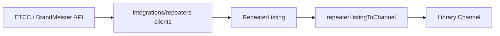

# Repeater directories

Tier-1 reference for **public repeater directory** workflows — searching ukrepeater.net (RSGB ETCC) and BrandMeister, importing results into the vendor-neutral library, and verifying existing channels against directory data.

**Tracking:** Phase 2 [#11](https://github.com/pskillen/codeplug-studio/issues/11) (Epic [#1](https://github.com/pskillen/codeplug-studio/issues/1)) · UI shell [#8](https://github.com/pskillen/codeplug-studio/issues/8)

**Source:** `src/app/routes/library/AddFrom*Page.tsx`, `src/app/components/repeaters/`, `src/integrations/repeaters/`

## Problem

Operators seed repeater channels from authoritative public directories instead of typing frequencies by hand. Studio normalises each provider's wire shape at the integration boundary, maps into library `Channel` rows, and supports diff-and-apply when a callsign already exists.

Repeater search is **not** a top-level nav item — it lives under library workflows (matching the codeplug-tool pattern).

## Implementation status

| Area                                  | Status   | Notes                                                                                              |
| ------------------------------------- | -------- | -------------------------------------------------------------------------------------------------- |
| UK repeater (ETCC) client             | Shipped  | Callsign + locator search                                                                          |
| BrandMeister client                   | Shipped  | Callsign search                                                                                    |
| Add from directory UI                 | Shipped  | Section nav routes; band/mode pills on results                                                     |
| Update existing (callsign match)      | Shipped  | Outline button → shared comparison dialog                                                          |
| Directory verify on channel edit      | Shipped  | `RepeaterVerifyPanel`                                                                              |
| Full ETCC mode flag parsing           | Shipped  | A/D/E/M/F/P/7/N → library modes                                                                    |
| Multi-mode import (`modeProfiles`)    | Shipped  | FM + DMR full profiles; other digital stubs                                                        |
| Multi-mode channel CRUD               | Deferred | [#16](https://github.com/pskillen/codeplug-studio/issues/16) — editor still single-profile on save |
| ETCC postcode / geocode / band search | Deferred | Only callsign + locator today                                                                      |
| Offline result cache                  | Deferred | In-session only                                                                                    |

## Documentation map

| Doc                                                              | Contents                                           |
| ---------------------------------------------------------------- | -------------------------------------------------- |
| This README                                                      | Workflows, boundaries, code anchors                |
| [ukrepeater API reference](../../reference/ukrepeater/README.md) | ETCC endpoints, mode flags, field mapping (tier 3) |
| [map](../map/README.md)                                          | Channel map (separate surface)                     |
| [library](../library/README.md)                                  | Channel entity CRUD                                |
| [app-shell](../app-shell/README.md)                              | Routes and section nav                             |

## Workflows

| Workflow                             | Entry point                                                               | Behaviour                                               |
| ------------------------------------ | ------------------------------------------------------------------------- | ------------------------------------------------------- |
| **New channel from reference**       | Library section nav → _Add from ukrepeater.net_ / _Add from BrandMeister_ | Search directory; add result as library channel         |
| **Update existing**                  | Same search UI when callsign already in library                           | Outline _Update existing_ → directory comparison dialog |
| **Check and update current channel** | Channel editor → _Check against directory_                                | Fetch by callsign; diff; apply selected fields          |

### Routes

- `/library/channels/add-from-ukrepeater`
- `/library/channels/add-from-brandmeister`

## Sources

| Source                  | Client                                                       | Search by         | Wire notes                                           |
| ----------------------- | ------------------------------------------------------------ | ----------------- | ---------------------------------------------------- |
| UK repeater (RSGB ETCC) | `searchUkRepeatersByCallsign` / `searchUkRepeatersByLocator` | callsign, locator | `tx`/`rx` in Hz; `modeCodes[]`; Maidenhead `locator` |
| BrandMeister            | `searchBrandmeisterByCallsign`                               | callsign          | DMR devices; `tx`/`rx` MHz strings; `lat`/`lng`      |

Both clients normalise to `RepeaterListing` (`src/integrations/repeaters/types.ts`).

## Data flow

| Step            | Module                                                       | Output                                 |
| --------------- | ------------------------------------------------------------ | -------------------------------------- |
| HTTP + parse    | `ukRepeaterClient.ts`, `brandmeisterClient.ts`               | `RepeaterListing`                      |
| Mode flags (UK) | `ukrepeater/modeCodes.ts`                                    | `modes[]`, `primaryMode`, `colourCode` |
| Profiles        | `buildModeProfiles.ts`                                       | `modeProfiles[]` on `Channel`          |
| Add             | `RepeaterDirectorySearch.tsx` → `persistence.putChannel`     | New library row                        |
| Verify / update | `RepeaterVerifyPanel.tsx`, `RepeaterListingUpdateDialog.tsx` | `channelDiff.ts` patch                 |

Frequency convention: `rxFrequencyHz` is what the radio **receives** (repeater output); `txFrequencyHz` is what it **transmits** (repeater input). ETCC field names are inverted — documented in [ukrepeater reference](../../reference/ukrepeater/README.md#frequency-inversion-critical).

### Multi-mode import

`buildModeProfilesFromListing` creates one `modeProfiles` entry per advertised mode:

- **Analogue (`fm`)** — full `ChannelModeProfileFM` with CTCSS on RX/TX tone when present.
- **DMR** — full `ChannelModeProfileDMR` with colour code from `M:n` flags.
- **Other digital** (`dstar`, `ysf`, `p25`, `nxdn`, `m17`, `tetra`) — mode-only stub `{ mode }` until dedicated profile types exist.

Example: `modeCodes: ["A", "D", "M:1", "F", "P", "N"]` → six profiles on import.

## UI components

| Component                         | Role                                                    |
| --------------------------------- | ------------------------------------------------------- |
| `RepeaterDirectorySearch.tsx`     | Shared search form + results table                      |
| `RepeaterListingUpdateDialog.tsx` | Directory comparison modal (diff table, apply selected) |
| `RepeaterVerifyPanel.tsx`         | Channel editor verify section                           |
| `findChannelByCallsign.ts`        | Case-insensitive library lookup                         |
| `ModePillsForRepeaterListing.tsx` | One pill per advertised mode on results                 |

## Boundaries

- HTTP clients in `src/integrations/repeaters/`; **`core` never makes network calls**.
- Mapping produces vendor-neutral library fields only — no CPS column names in `app/` or `core/`.
- Both APIs allow browser CORS; failures surface as `RepeaterDirectoryError` in the UI.

## Known gaps

- Channel editor collapses `modeProfiles` to a single FM or DMR profile on save — breaks multi-mode imports until [#16](https://github.com/pskillen/codeplug-studio/issues/16).
- No typed channel profiles for non-FM/DMR digital modes beyond stubs.
- BrandMeister listings always map to DMR-only profiles.
- UK search: no postcode, address, keeper, or band endpoints wired yet.

## Manual verify

1. Create/select a project with an empty library.
2. Library → _Add from ukrepeater.net_ → search `gb3da` → confirm band/mode pills; _Add to library_.
3. Search again → _Update existing_ opens comparison dialog.
4. Open channel → _Check against directory_ → apply a field patch.
5. Search a multi-mode repeater (e.g. `gb7dc`) → add → inspect `modeProfiles` in storage (multiple entries).

## Related

- [ukrepeater reference](../../reference/ukrepeater/README.md)
- [map](../map/README.md) · [library](../library/README.md) · [app-shell](../app-shell/README.md)
- Epic progress: [epic-1-progress.md](../../poc-migration/epic-1-progress.md)
