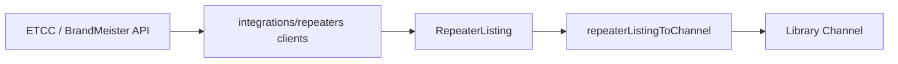

# Repeater directories

Tier-1 reference for **public repeater directory** workflows — searching ukrepeater.net (RSGB ETCC), BrandMeister, IRTS (Republic of Ireland), and RepeaterBook, importing results into the vendor-neutral library, and verifying existing channels against directory data.

**Tracking:** Phase 2 [#11](https://github.com/pskillen/codeplug-studio/issues/11) (Epic [#1](https://github.com/pskillen/codeplug-studio/issues/1)) · Search parity [#43](https://github.com/pskillen/codeplug-studio/issues/43) · BrandMeister parity [#44](https://github.com/pskillen/codeplug-studio/issues/44) · IRTS Ireland [#273](https://github.com/pskillen/codeplug-studio/issues/273) · RepeaterBook [#274](https://github.com/pskillen/codeplug-studio/issues/274) · Callsign-only import gate [#53](https://github.com/pskillen/codeplug-studio/issues/53) · BrandMeister TG + RX list [#65](https://github.com/pskillen/codeplug-studio/issues/65) · UK client-side filters [#191](https://github.com/pskillen/codeplug-studio/issues/191) · UK multi-band + geometry filters [#333](https://github.com/pskillen/codeplug-studio/issues/333)

**Source:** `src/app/routes/library/AddFrom*Page.tsx`, `src/app/components/repeaters/`, `src/integrations/repeaters/`

## Problem

Operators seed repeater channels from authoritative public directories instead of typing frequencies by hand. Studio normalises each provider's wire shape at the integration boundary, maps into library `Channel` rows, and supports diff-and-apply when a callsign already exists.

Repeater search is **not** a top-level nav item — it lives under library workflows (matching the codeplug-tool pattern).

## Implementation status

| Area                                | Status   | Notes                                                                                                                                                                                                                                                                                                                              |
| ----------------------------------- | -------- | ---------------------------------------------------------------------------------------------------------------------------------------------------------------------------------------------------------------------------------------------------------------------------------------------------------------------------------- |
| UK repeater (ETCC) client           | Shipped  | Callsign, locator; town via geocode → locator ([#43](https://github.com/pskillen/codeplug-studio/issues/43))                                                                                                                                                                                                                       |
| UK unified search UI                | Shipped  | Auto-detect query; multi-band (OR) + mode + simplex/split/all geometry + operational client-side filters; use-my-location; bulk add ([#43](https://github.com/pskillen/codeplug-studio/issues/43), [#191](https://github.com/pskillen/codeplug-studio/issues/191), [#333](https://github.com/pskillen/codeplug-studio/issues/333)) |
| Directory search results map        | Shipped  | All directory searches with geolocated listings ([#118](https://github.com/pskillen/codeplug-studio/issues/118))                                                                                                                                                                                                                   |
| Library channel link on callsign    | Shipped  | Callsign links to channel editor when callsign matches library ([#118](https://github.com/pskillen/codeplug-studio/issues/118))                                                                                                                                                                                                    |
| BrandMeister client                 | Shipped  | Callsign search ([#44](https://github.com/pskillen/codeplug-studio/issues/44))                                                                                                                                                                                                                                                     |
| BrandMeister shared search shell    | Shipped  | Same results table; UK-only controls hidden ([#44](https://github.com/pskillen/codeplug-studio/issues/44))                                                                                                                                                                                                                         |
| Update existing (callsign match)    | Shipped  | Outline button → shared comparison dialog                                                                                                                                                                                                                                                                                          |
| Import duplicate gate (callsign)    | Shipped  | Add blocked only when callsign already in library — not channel `name` ([#53](https://github.com/pskillen/codeplug-studio/issues/53))                                                                                                                                                                                              |
| Directory verify on channel edit    | Shipped  | ukrepeater.net, IRTS, RepeaterBook; BrandMeister when DMR profile ([#43](https://github.com/pskillen/codeplug-studio/issues/43), [#274](https://github.com/pskillen/codeplug-studio/issues/274))                                                                                                                                   |
| Title case on UK import             | Shipped  | Toggle on search and verify ([#43](https://github.com/pskillen/codeplug-studio/issues/43))                                                                                                                                                                                                                                         |
| BrandMeister comment on import      | Shipped  | Omitted by default ([#44](https://github.com/pskillen/codeplug-studio/issues/44))                                                                                                                                                                                                                                                  |
| Full ETCC mode flag parsing         | Shipped  | A/D/E/M/F/P/7/N → library modes                                                                                                                                                                                                                                                                                                    |
| Multi-mode import (`modeProfiles`)  | Shipped  | Typed profiles for FM/DMR/D-STAR/YSF/NXDN/TETRA; P25/M17 stubs                                                                                                                                                                                                                                                                     |
| Multi-mode channel CRUD             | Shipped  | [#16](https://github.com/pskillen/codeplug-studio/issues/16) — multi-select + tabbed profiles editor                                                                                                                                                                                                                               |
| `maidenheadLocator` on import       | Shipped  | [#28](https://github.com/pskillen/codeplug-studio/issues/28) — from ETCC locator or derived coords                                                                                                                                                                                                                                 |
| BrandMeister TG + RX list import    | Shipped  | [#65](https://github.com/pskillen/codeplug-studio/issues/65) — optional on add; dedupe TGs by `digitalId`                                                                                                                                                                                                                          |
| BrandMeister RX list verify sync    | Shipped  | [#65](https://github.com/pskillen/codeplug-studio/issues/65) — update or fork shared list after channel diff                                                                                                                                                                                                                       |
| IRTS Ireland client                 | Shipped  | Anytone CSV via `/api/irts/repeaters` proxy ([#273](https://github.com/pskillen/codeplug-studio/issues/273))                                                                                                                                                                                                                       |
| IRTS catalogue search UI            | Shipped  | Load-on-mount ROI list; callsign/location + band/mode filters ([#273](https://github.com/pskillen/codeplug-studio/issues/273))                                                                                                                                                                                                     |
| IRTS verify on channel edit         | Shipped  | _Check IRTS_ alongside ukrepeater ([#273](https://github.com/pskillen/codeplug-studio/issues/273))                                                                                                                                                                                                                                 |
| RepeaterBook client                 | Shipped  | Export API via `/api/repeaterbook/export` proxy; per-user `rbuapp_` token ([#274](https://github.com/pskillen/codeplug-studio/issues/274))                                                                                                                                                                                         |
| RepeaterBook Settings token         | Shipped  | localStorage + obtain-token instructions; deep-link from search UI ([#274](https://github.com/pskillen/codeplug-studio/issues/274))                                                                                                                                                                                                |
| RepeaterBook search UI              | Shipped  | NA/ROW region; country autocomplete; locator filter; use-my-location; state/country + callsign; band/mode/geometry filters ([#274](https://github.com/pskillen/codeplug-studio/issues/274))                                                                                                                                        |
| RepeaterBook verify on channel edit | Shipped  | _Check RepeaterBook_ when token configured ([#274](https://github.com/pskillen/codeplug-studio/issues/274))                                                                                                                                                                                                                        |
| Bulk verify from channel list       | Deferred | [#49](https://github.com/pskillen/codeplug-studio/issues/49) — separate PR                                                                                                                                                                                                                                                         |
| ETCC keeper endpoint                | Deferred | Not in archive query router                                                                                                                                                                                                                                                                                                        |
| Offline result cache                | Deferred | In-session only                                                                                                                                                                                                                                                                                                                    |

## Documentation map

| Doc                                                              | Contents                                                                     |
| ---------------------------------------------------------------- | ---------------------------------------------------------------------------- |
| This README                                                      | Workflows, boundaries, code anchors                                          |
| [ukrepeater API reference](../../reference/ukrepeater/README.md) | ETCC endpoints, mode flags, field mapping (tier 3)                           |
| [BrandMeister reference](../../reference/brandmeister/README.md) | v2 device + talk group endpoints, field mapping (tier 3)                     |
| [IRTS reference](../../reference/irts/README.md)                 | Anytone CSV + CORS proxy, field mapping (tier 3)                             |
| [RepeaterBook reference](../../reference/repeaterbook/README.md) | Export API, token model, field mapping (tier 3)                              |
| [irts-progress.md](irts-progress.md)                             | [#273](https://github.com/pskillen/codeplug-studio/issues/273) execution log |
| [repeaterbook-progress.md](repeaterbook-progress.md)             | [#274](https://github.com/pskillen/codeplug-studio/issues/274) execution log |
| [map](../map/README.md)                                          | Embedded channel map on Library sections                                     |
| [library](../library/README.md)                                  | Channel entity CRUD                                                          |
| [app-shell](../app-shell/README.md)                              | Routes and section nav                                                       |

## Workflows

| Workflow                             | Entry point                                                                                                                                                | Behaviour                                                                                                                                                                                                                                                                                                                                                                                                                                                   |
| ------------------------------------ | ---------------------------------------------------------------------------------------------------------------------------------------------------------- | ----------------------------------------------------------------------------------------------------------------------------------------------------------------------------------------------------------------------------------------------------------------------------------------------------------------------------------------------------------------------------------------------------------------------------------------------------------- |
| **New channel from reference**       | Library section nav → **Add from…** (ukrepeater.net, OpenAIP, BrandMeister, IRTS, RepeaterBook)                                                            | Search directory; add result(s) as library channel(s). BrandMeister: optional talk groups + RX group list ([#65](https://github.com/pskillen/codeplug-studio/issues/65)). IRTS: full ROI catalogue with client-side filters ([#273](https://github.com/pskillen/codeplug-studio/issues/273)). RepeaterBook: NA/ROW export search with per-user token ([#274](https://github.com/pskillen/codeplug-studio/issues/274)). Duplicate gate is **callsign only**. |
| **Update existing**                  | Same search UI when callsign already in library                                                                                                            | Outline _Update existing_ → directory comparison dialog                                                                                                                                                                                                                                                                                                                                                                                                     |
| **Check and update current channel** | Channel editor → _Check ukrepeater.net_ / _Check IRTS_ / _Check RepeaterBook_ / _Check BrandMeister repeater_ / _Check BrandMeister talk groups & RX list_ | Repeater field diff (UK, IRTS, RepeaterBook, or BM); separate BM button for RX group list sync ([#65](https://github.com/pskillen/codeplug-studio/issues/65))                                                                                                                                                                                                                                                                                               |

### Routes

- `/library/channels/add-from-ukrepeater`
- `/library/channels/add-from-brandmeister`
- `/library/channels/add-from-irts`
- `/library/channels/add-from-repeaterbook`

## Sources

| Source                  | Client / router                                      | Search by                                                                                                                  | Wire notes                                            |
| ----------------------- | ---------------------------------------------------- | -------------------------------------------------------------------------------------------------------------------------- | ----------------------------------------------------- |
| UK repeater (RSGB ETCC) | `searchUkRepeaters` / `ukrepeater/queryRouter.ts`    | callsign, locator, town (geocode); multi-band (OR), geometry (simplex/split/all), mode, operational via post-fetch filters | `tx`/`rx` in Hz; `modeCodes[]`; Maidenhead `locator`  |
| BrandMeister            | `searchBrandmeisterByCallsign`                       | callsign only                                                                                                              | DMR devices; `tx`/`rx` MHz strings; `lat`/`lng`       |
| IRTS (ROI)              | `fetchIrtsRepeaters` / `irtsClient.ts`               | full catalogue; filter by callsign/location, multi-band, mode client-side                                                  | Anytone CSV; `A-Analog` / `D-Digital`; proxied CSV    |
| RepeaterBook            | `searchRepeaterBook` / `repeaterbook/queryRouter.ts` | NA: state/country/callsign; ROW: country/callsign; band/mode/geometry client-side                                          | Export JSON via Pages Function proxy; `rbuapp_` token |

All clients normalise to `RepeaterListing` (`src/integrations/repeaters/types.ts`).

## Data flow

| Step            | Module                                                                                                              | Output                                                                                                                                                                                                                                                 |
| --------------- | ------------------------------------------------------------------------------------------------------------------- | ------------------------------------------------------------------------------------------------------------------------------------------------------------------------------------------------------------------------------------------------------ |
| HTTP + parse    | `ukRepeaterClient.ts`, `brandmeisterClient.ts`, `irtsClient.ts`, `repeaterbook/repeaterbookClient.ts`               | `RepeaterListing`                                                                                                                                                                                                                                      |
| Query routing   | `ukrepeater/queryRouter.ts`                                                                                         | Auto-detect kind; geocode → locator; multi-band, geometry, mode, operational narrowed in `filterListings` after fetch ([#191](https://github.com/pskillen/codeplug-studio/issues/191), [#333](https://github.com/pskillen/codeplug-studio/issues/333)) |
| Mode flags (UK) | `ukrepeater/modeCodes.ts`                                                                                           | `modes[]`, `primaryMode`, `colourCode`                                                                                                                                                                                                                 |
| Profiles        | `buildModeProfiles.ts`                                                                                              | `modeProfiles[]` on `Channel`                                                                                                                                                                                                                          |
| Add             | `RepeaterDirectorySearch.tsx` → `persistence.putChannel` (UK) or `persistBrandMeisterImport` (BM + optional TG/RGL) | New library row(s)                                                                                                                                                                                                                                     |
| Verify / update | `RepeaterVerifyPanel.tsx`, `RepeaterListingUpdateDialog.tsx`, `BrandmeisterRxGroupListSyncDialog.tsx`               | `channelDiff.ts` patch; RX list sync ([#65](https://github.com/pskillen/codeplug-studio/issues/65)); RepeaterBook verify ([#274](https://github.com/pskillen/codeplug-studio/issues/274))                                                              |
| Listing match   | `matchListing.ts`                                                                                                   | Auto-pick on verify when unambiguous                                                                                                                                                                                                                   |

Frequency convention: `rxFrequencyHz` is what the radio **receives** (repeater output); `txFrequencyHz` is what it **transmits** (repeater input). ETCC field names are inverted — documented in [ukrepeater reference](../../reference/ukrepeater/README.md#frequency-inversion-critical).

### Multi-mode import

`buildModeProfilesFromListing` creates one `modeProfiles` entry per advertised mode:

- **Analogue (`fm`, …)** — full `ChannelModeProfileAnalog` with CTCSS on RX/TX tone when present.
- **DMR** — full `ChannelModeProfileDMR` with colour code from `M:n` flags.
- **D-STAR, YSF, NXDN, TETRA** — full typed profiles with CPS-informed defaults.
- **P25, M17** — stub `{ mode }` until dedicated profile types ship.

Example: `modeCodes: ["A", "D", "M:1", "F", "P", "N"]` → six profiles on import.

## UI components

| Component                               | Role                                                                                                           |
| --------------------------------------- | -------------------------------------------------------------------------------------------------------------- |
| `RepeaterDirectorySearch.tsx`           | Shared search form + results table (source capabilities)                                                       |
| `RepeaterListingUpdateDialog.tsx`       | Directory comparison modal (diff table, apply selected)                                                        |
| `RepeaterVerifyPanel.tsx`               | Channel editor verify (UK, IRTS, RepeaterBook, optional BrandMeister)                                          |
| `BrandmeisterRxGroupListSyncDialog.tsx` | BrandMeister RX group list diff + update/create ([#65](https://github.com/pskillen/codeplug-studio/issues/65)) |
| `findChannelByCallsign.ts`              | Case-insensitive library lookup                                                                                |
| `repeaterDirectoryRows.ts`              | Result rows; callsign-only duplicate gate for import                                                           |
| `ModePillsForRepeaterListing.tsx`       | One pill per advertised mode on results                                                                        |
| `useRepeaterDirectorySearch.ts`         | Search state hook (UK filters, geocode token)                                                                  |

## Boundaries

- HTTP clients in `src/integrations/repeaters/`; **`core` never makes network calls**.
- Mapping produces vendor-neutral library fields only — no CPS column names in `app/` or `core/`.
- ukrepeater.net and BrandMeister allow browser CORS; IRTS and RepeaterBook use same-origin Pages Function proxies with a shared origin allowlist (deploy hostnames + `http://localhost:5173` — see [build docs](../../build/README.md#pages-functions-cors-bridges)). RepeaterBook forwards each user's `rbuapp_` token and sets the approved User-Agent server-side. Failures surface as `RepeaterDirectoryError` in the UI.

## Known gaps

- P25/M17 typed channel profiles beyond stubs.
- BrandMeister listings always map to DMR-only profiles.
- BrandMeister: no locator, band, town, or use-my-location search (API limit — see [BrandMeister reference](../../reference/brandmeister/README.md)).
- IRTS: no coordinates/locator in Anytone CSV; map empty for IRTS results ([#273](https://github.com/pskillen/codeplug-studio/issues/273) — see [irts-outstanding.md](irts-outstanding.md)).
- RepeaterBook: sessionStorage cache and 429 backoff deferred ([#73](https://github.com/pskillen/codeplug-studio/issues/73), [#341](https://github.com/pskillen/codeplug-studio/issues/341) — see [repeaterbook-outstanding.md](repeaterbook-outstanding.md)).
- Bulk directory verify from channel list ([#49](https://github.com/pskillen/codeplug-studio/issues/49)).

## Manual verify

1. Create/select a project with an empty library.
2. Library → _Add from ukrepeater.net_ → search `gb3da`, `io91`, or a town name with band and/or mode filters applied → confirm filtered results and simplex rows. Typing a band token (e.g. `2m`) sets the band filter and prompts for a callsign, locator, or town.
3. _Use my location_ seeds a locator search.
4. Bulk-select results → _Add selected_.
5. Library → _Add from BrandMeister_ → search `GB7AC` → confirm **Import talk groups and RX group list** (default on) creates channel, talk groups, and RX list; DMR profile linked.
6. Re-add same callsign with TG import → talk groups deduped by `digitalId`.
7. Open a DMR channel → _Check BrandMeister repeater_ for field diff; _Check BrandMeister talk groups & RX list_ for RX list sync (separate actions).
8. Library → _Add from IRTS_ → confirm catalogue loads; filter by `EI7` and 70 cm band → add a channel.
9. Open the channel → _Check IRTS_ → apply a frequency or tone update from the diff dialog.
10. Settings → RepeaterBook → paste `rbuapp_…` token → Save.
11. Library → _Add from RepeaterBook_ → NA search with state ID + callsign (or ROW country) → add a channel.
12. Open the channel → _Check RepeaterBook_ → apply an update from the diff dialog.

## Related

- [ukrepeater reference](../../reference/ukrepeater/README.md) · [BrandMeister reference](../../reference/brandmeister/README.md) · [IRTS reference](../../reference/irts/README.md) · [RepeaterBook reference](../../reference/repeaterbook/README.md)
- [map](../map/README.md) · [library](../library/README.md) · [app-shell](../app-shell/README.md)
- Parity progress: [repeater-parity-progress.md](repeater-parity-progress.md) · BrandMeister TG/RGL: [brandmeister-tg-progress.md](brandmeister-tg-progress.md) · IRTS: [irts-progress.md](irts-progress.md) · RepeaterBook: [repeaterbook-progress.md](repeaterbook-progress.md)
