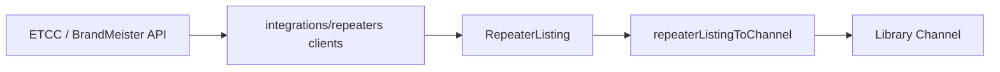

# Repeater directories

Tier-1 reference for **public repeater directory** workflows — searching ukrepeater.net (RSGB ETCC) and BrandMeister, importing results into the vendor-neutral library, and verifying existing channels against directory data.

**Tracking:** Phase 2 [#11](https://github.com/pskillen/codeplug-studio/issues/11) (Epic [#1](https://github.com/pskillen/codeplug-studio/issues/1)) · Search parity [#43](https://github.com/pskillen/codeplug-studio/issues/43) · BrandMeister parity [#44](https://github.com/pskillen/codeplug-studio/issues/44) · Callsign-only import gate [#53](https://github.com/pskillen/codeplug-studio/issues/53)

**Source:** `src/app/routes/library/AddFrom*Page.tsx`, `src/app/components/repeaters/`, `src/integrations/repeaters/`

## Problem

Operators seed repeater channels from authoritative public directories instead of typing frequencies by hand. Studio normalises each provider's wire shape at the integration boundary, maps into library `Channel` rows, and supports diff-and-apply when a callsign already exists.

Repeater search is **not** a top-level nav item — it lives under library workflows (matching the codeplug-tool pattern).

## Implementation status

| Area                               | Status   | Notes                                                                                                                                 |
| ---------------------------------- | -------- | ------------------------------------------------------------------------------------------------------------------------------------- |
| UK repeater (ETCC) client          | Shipped  | Callsign, locator, band; town via geocode → locator ([#43](https://github.com/pskillen/codeplug-studio/issues/43))                    |
| UK unified search UI               | Shipped  | Auto-detect query, filters, use-my-location, bulk add, simplex display ([#43](https://github.com/pskillen/codeplug-studio/issues/43)) |
| BrandMeister client                | Shipped  | Callsign search ([#44](https://github.com/pskillen/codeplug-studio/issues/44))                                                        |
| BrandMeister shared search shell   | Shipped  | Same results table; UK-only controls hidden ([#44](https://github.com/pskillen/codeplug-studio/issues/44))                            |
| Update existing (callsign match)   | Shipped  | Outline button → shared comparison dialog                                                                                             |
| Import duplicate gate (callsign)   | Shipped  | Add blocked only when callsign already in library — not channel `name` ([#53](https://github.com/pskillen/codeplug-studio/issues/53)) |
| Directory verify on channel edit   | Shipped  | ukrepeater.net always; BrandMeister when DMR profile ([#43](https://github.com/pskillen/codeplug-studio/issues/43))                   |
| Title case on UK import            | Shipped  | Toggle on search and verify ([#43](https://github.com/pskillen/codeplug-studio/issues/43))                                            |
| BrandMeister comment on import     | Shipped  | Omitted by default ([#44](https://github.com/pskillen/codeplug-studio/issues/44))                                                     |
| Full ETCC mode flag parsing        | Shipped  | A/D/E/M/F/P/7/N → library modes                                                                                                       |
| Multi-mode import (`modeProfiles`) | Shipped  | Typed profiles for FM/DMR/D-STAR/YSF/NXDN/TETRA; P25/M17 stubs                                                                        |
| Multi-mode channel CRUD            | Shipped  | [#16](https://github.com/pskillen/codeplug-studio/issues/16) — multi-select + tabbed profiles editor                                  |
| `maidenheadLocator` on import      | Shipped  | [#28](https://github.com/pskillen/codeplug-studio/issues/28) — from ETCC locator or derived coords                                    |
| Bulk verify from channel list      | Deferred | [#49](https://github.com/pskillen/codeplug-studio/issues/49) — separate PR                                                            |
| ETCC keeper endpoint               | Deferred | Not in archive query router                                                                                                           |
| Offline result cache               | Deferred | In-session only                                                                                                                       |

## Documentation map

| Doc                                                              | Contents                                           |
| ---------------------------------------------------------------- | -------------------------------------------------- |
| This README                                                      | Workflows, boundaries, code anchors                |
| [ukrepeater API reference](../../reference/ukrepeater/README.md) | ETCC endpoints, mode flags, field mapping (tier 3) |
| [BrandMeister reference](../../reference/brandmeister/README.md) | v2 byCall endpoint, field mapping, limits (tier 3) |
| [map](../map/README.md)                                          | Embedded channel map on Library sections           |
| [library](../library/README.md)                                  | Channel entity CRUD                                |
| [app-shell](../app-shell/README.md)                              | Routes and section nav                             |

## Workflows

| Workflow                             | Entry point                                                               | Behaviour                                               |
| ------------------------------------ | ------------------------------------------------------------------------- | ------------------------------------------------------- |
| **New channel from reference**       | Library section nav → _Add from ukrepeater.net_ / _Add from BrandMeister_ | Search directory; add result(s) as library channel(s). Duplicate gate is **callsign only** — two repeaters may share a town/qualifier `name`. |
| **Update existing**                  | Same search UI when callsign already in library                           | Outline _Update existing_ → directory comparison dialog                                                                                     |
| **Check and update current channel** | Channel editor → _Check ukrepeater.net_ / _Check BrandMeister_            | Fetch by callsign; auto-match listing; diff; apply      |

### Routes

- `/library/channels/add-from-ukrepeater`
- `/library/channels/add-from-brandmeister`

## Sources

| Source                  | Client / router                                   | Search by                               | Wire notes                                           |
| ----------------------- | ------------------------------------------------- | --------------------------------------- | ---------------------------------------------------- |
| UK repeater (RSGB ETCC) | `searchUkRepeaters` / `ukrepeater/queryRouter.ts` | callsign, locator, band, town (geocode) | `tx`/`rx` in Hz; `modeCodes[]`; Maidenhead `locator` |
| BrandMeister            | `searchBrandmeisterByCallsign`                    | callsign only                           | DMR devices; `tx`/`rx` MHz strings; `lat`/`lng`      |

Both clients normalise to `RepeaterListing` (`src/integrations/repeaters/types.ts`).

## Data flow

| Step            | Module                                                       | Output                                 |
| --------------- | ------------------------------------------------------------ | -------------------------------------- |
| HTTP + parse    | `ukRepeaterClient.ts`, `brandmeisterClient.ts`               | `RepeaterListing`                      |
| Query routing   | `ukrepeater/queryRouter.ts`                                  | Auto-detect kind; geocode → locator    |
| Mode flags (UK) | `ukrepeater/modeCodes.ts`                                    | `modes[]`, `primaryMode`, `colourCode` |
| Profiles        | `buildModeProfiles.ts`                                       | `modeProfiles[]` on `Channel`          |
| Add             | `RepeaterDirectorySearch.tsx` → `persistence.putChannel`     | New library row(s)                     |
| Verify / update | `RepeaterVerifyPanel.tsx`, `RepeaterListingUpdateDialog.tsx` | `channelDiff.ts` patch                 |
| Listing match   | `matchListing.ts`                                            | Auto-pick on verify when unambiguous   |

Frequency convention: `rxFrequencyHz` is what the radio **receives** (repeater output); `txFrequencyHz` is what it **transmits** (repeater input). ETCC field names are inverted — documented in [ukrepeater reference](../../reference/ukrepeater/README.md#frequency-inversion-critical).

### Multi-mode import

`buildModeProfilesFromListing` creates one `modeProfiles` entry per advertised mode:

- **Analogue (`fm`, …)** — full `ChannelModeProfileAnalog` with CTCSS on RX/TX tone when present.
- **DMR** — full `ChannelModeProfileDMR` with colour code from `M:n` flags.
- **D-STAR, YSF, NXDN, TETRA** — full typed profiles with CPS-informed defaults.
- **P25, M17** — stub `{ mode }` until dedicated profile types ship.

Example: `modeCodes: ["A", "D", "M:1", "F", "P", "N"]` → six profiles on import.

## UI components

| Component                         | Role                                                     |
| --------------------------------- | -------------------------------------------------------- |
| `RepeaterDirectorySearch.tsx`     | Shared search form + results table (source capabilities) |
| `RepeaterListingUpdateDialog.tsx` | Directory comparison modal (diff table, apply selected)  |
| `RepeaterVerifyPanel.tsx`         | Channel editor verify (UK + optional BrandMeister)       |
| `findChannelByCallsign.ts`        | Case-insensitive library lookup                          |
| `repeaterDirectoryRows.ts`        | Result rows; callsign-only duplicate gate for import     |
| `ModePillsForRepeaterListing.tsx` | One pill per advertised mode on results                  |
| `useRepeaterDirectorySearch.ts`   | Search state hook (UK filters, geocode token)            |

## Boundaries

- HTTP clients in `src/integrations/repeaters/`; **`core` never makes network calls**.
- Mapping produces vendor-neutral library fields only — no CPS column names in `app/` or `core/`.
- Both APIs allow browser CORS; failures surface as `RepeaterDirectoryError` in the UI.

## Known gaps

- P25/M17 typed channel profiles beyond stubs.
- BrandMeister listings always map to DMR-only profiles.
- BrandMeister: no locator, band, town, or use-my-location search (API limit — see [BrandMeister reference](../../reference/brandmeister/README.md)).
- Bulk directory verify from channel list ([#49](https://github.com/pskillen/codeplug-studio/issues/49)).

## Manual verify

1. Create/select a project with an empty library.
2. Library → _Add from ukrepeater.net_ → search `gb3da`, `io91`, `2m`, or a town name → confirm filters and simplex rows.
3. _Use my location_ seeds a locator search.
4. Bulk-select results → _Add selected_.
5. Library → _Add from BrandMeister_ → search a DMR callsign → confirm empty `comment` on import.
6. Open a DMR channel → _Check ukrepeater.net_ and _Check BrandMeister_ → apply a field patch.

## Related

- [ukrepeater reference](../../reference/ukrepeater/README.md) · [BrandMeister reference](../../reference/brandmeister/README.md)
- [map](../map/README.md) · [library](../library/README.md) · [app-shell](../app-shell/README.md)
- Parity progress: [repeater-parity-progress.md](repeater-parity-progress.md)
