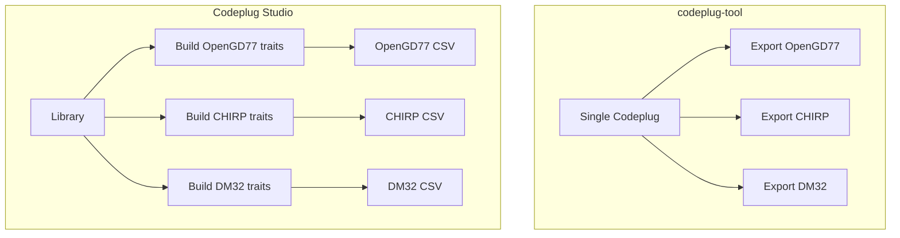

# Epic 1 context — migration from codeplug-tool to Codeplug Studio

**Purpose:** Background for any agent working on the greenfield migration. Captures motivations, product thesis, and architectural intent from planning discussions. **Not** a task checklist — see [Epic #1](https://github.com/pskillen/codeplug-studio/issues/1) and [DESIGN.md](../../DESIGN.md) for deliverables and the living constitution.

**Repos:**

| Repo | Role |
| --- | --- |
| [pskillen/codeplug-studio](https://github.com/pskillen/codeplug-studio) | **Active** — greenfield product |
| [pskillen/codeplug-tool](https://github.com/pskillen/codeplug-tool) | **Archive reference** — 500+ commits, pre-release prototype |

---

## Why a new repo instead of evolving the old one

The old repo is substantial (500+ commits, dozens of PRs) but has **no users** — not even beta. That removes migration pressure: no operator data to preserve, no need to keep `main` continuously shippable through a long in-place refactor.

More importantly, **foundational design principles turned out to be wrong** for how the product should work. Unwinding those from 500 commits of model, import/export, docs, and agent instructions is harder than a clean slate with **selective salvage**.

The chosen approach:

- **New repo** (`codeplug-studio`) with correct folder boundaries and agent instructions from the start.
- **Copy/adapt** wire-format knowledge, import parsers (simplified), and UI **widgets** — not routes, store shape, or merge/provenance stack.
- **Rewrite** UX flows, data model (library + builds), and most of the app layer.
- **Archive** `codeplug-tool` when Studio reaches usable parity (roughly after library UI without CSV I/O).

This is **not** a full rewrite of import/export logic for its own sake. It is a new shell, new product shape, and new axioms — with proven code borrowed where it still fits.

---

## Product name and positioning

**Codeplug Studio** — browser-based designer for amateur radio codeplug layouts.

- Tagline direction: *Design once. Build per radio.*
- "Studio" implies craft/workshop; still searchable alongside "codeplug" in README/subtitle.
- Does **not** flash radios or replace vendor CPS. Export → operator imports into OpenGD77 CPS, CHIRP, etc.

---

## How the product shape differs (the important part)

### Old ethos (codeplug-tool)

**One codeplug project → export buttons for many formats.**

The operator maintained a single in-memory `Codeplug` (channels, zones, talk groups, contacts) and picked OpenGD77 / CHIRP / DM32 at export time. The same zone model, same navigation, same CRUD assumptions applied regardless of how different radios actually work.

That felt wrong because:

- Radios use **overlapping but highly disjoint concepts and terminology** (zones vs flat memories vs scan lists).
- Exporting the same logical layout to CHIRP and OpenGD77 forced compromises in the internal model and UI.
- "Pick a format and export" hid the fact that each radio wants a **different workflow**.

### New ethos (Codeplug Studio)

**One library per project → one or more format builds, each with a workflow suited to that radio.**

| Layer | What it holds |
| --- | --- |
| **Library** | Master inventory: channels, talk groups, contacts, RX group lists, etc. RF semantics live here. Curated once. |
| **Format build** | Per-target assembly: which library entities are included, how they are **organised** for one CPS format/profile (zones, memory order, scan lists, expansion rules). |

Operator journey (conceptual):

1. Build or import into the **library** (repeaters, talk groups, locations).
2. Create a **build** for "my OpenGD77 1701" — zone-centric workflow.
3. Create another **build** for "my CHIRP UV-5R" — flat memory list, per-channel scan flags.
4. Same library channels; different organisation and export paths.

User-facing copy may still say "codeplug"; internal docs say **library** and **build**.

### UX intent

- **Keep** most individual UI capabilities from the old app (map, DataTable, CRUD field components, repeater API integrations, reports).
- **Redo** user **flows** and navigation — home, project switching, import/export entry points, entity management scoped to library vs build.
- Phase 2 target: broad feature parity **without** CSV import/export — prove library + map + repeater APIs + local persistence first.

---

## Principles we dropped and what replaced them

### Round-trip fidelity (dropped)

**Old:** Re-importing an exported CPS file should match the original. This was a hard quality bar.

**Why it hurt:** It shaped `meta.imported` provenance, wire-name merge idempotency, `opengd77Extras`/wire bags, export serialisation that replayed import cells, and a large fidelity-contract doc stack. The model became a vehicle for replaying CPS files instead of expressing operator intent.

**New:**

- **Import-first** — CPS → internal types must be thorough and tested.
- **Export as projection** — library + build → CPS files; re-import **may** differ.
- **Document loss** — per format, per column where needed; do not fake fidelity.
- **Merge/match best-effort** — heuristics + user confirmation; full idempotency desirable but not guaranteed.
- **Model fields drive export** — no stash-and-replay of raw wire columns in metadata.

### Round-trip as testing strategy (dropped — with a lesson)

Round-trip system tests (`import → export → re-import`) often stood in for **proper bidirectional mapping tests** because we lacked:

- Explicit **wire → internal** fixtures with golden internal snapshots.
- Explicit **internal → wire** fixtures built from constructed library + build (no import step).

That proxy pushed complexity into the model. **Do not repeat it.**

**New testing bar:**

- Import tests: CPS fixtures → expected library + build trait layout.
- Export tests: constructed in-memory project → expected wire output.
- **Different fixtures per direction.** Round-trip optional smoke only, with documented expected loss.

See [DESIGN.md — Testing](../../DESIGN.md#testing).

---

## Build capability traits (how builds differ without N custom apps)

Radios differ in a **small set of behavioural concerns**, not infinite one-off models. Most targets are a **permutation of traits** (plus numeric caps at the wire boundary).

Initial trait set (extend as we learn):

| Trait | Meaning |
| --- | --- |
| **Zone grouping** | Named groups of channels; operator switches zone on radio |
| **Flat memory list** | No zones — one ordered channel/memory list |
| **Per-channel scan flag** | Scan on/skip per channel; no separate scan-list entity |
| **Scan lists** | Named scan lists distinct from TX grouping |
| **Zone as scan list** | Zone membership *is* the scan scope |
| **Multi talk group per channel** | One RF channel; pick repeater + TG on the channel |
| **m×n channel expansion** | CPS requires one memory per repeater×talkgroup pair |

**Split responsibilities:**

- **Trait profile** (per format/profile) → which traits apply.
- **FormatBuild model + build UI** → composed from shared trait modules (`zone-grouping/`, `flat-memories/`, `scan-lists/`, …).
- **Wire adapters** (per format/profile) → map `assemble(build, library)` to CSV/YAML shapes.

Do **not** put OpenGD77-shaped zones in the library because OpenGD77 has `Zones.csv`. Put **zone grouping** on the build when the trait profile says so.

Example permutations (informal):

- **OpenGD77-style DMR:** zone grouping, zone-as-scan-list, multi-TG per channel (expansion at export for some targets).
- **CHIRP analogue:** flat memory list, per-channel scan flag.
- **DM32:** zone grouping, scan lists, m×n expansion — adapter maps same trait concepts to different columns.

---

## Architecture intent (separation of concerns)

Old repo: one big `src/` — `lib/` mixed domain, import/export, integrations, and UI-adjacent helpers; fat React store; thick routes.

New target:

```text
src/core/           # Models, domain, import/export formats, services — NO React
src/integrations/   # localStorage, Google Drive, repeater HTTP APIs
src/app/            # React routes, features, components, thin state
```

**Dependency rule:** `app` → `core`; `integrations` → `core`; never `core` → `app`.

**Browser persistence** (IndexedDB, hybrid normalisation): planning notes in [storage.md](storage.md) — not finalised until Phase 1/2.

**Application services** sit between UI and adapters: `importIntoLibrary`, `exportBuild`, `assemble(build, library)`. Routes should not call format adapters or low-level mutations ad hoc.

Still a **single Vite SPA**, no backend, GitHub Pages on release publish. All "API" work is in the browser.

---

## Vendor boundaries (still true, reframed)

The **library** and domain layer stay vendor-neutral:

- UUID `id` foreign keys; `name` is a label, not an FK.
- No `OPENGD77_MAX_*` in validation or library CRUD.
- Wire strings, column names, cardinality caps → `core/import-export/formats/` and `docs/reference/<format>/`.

**Formats are siblings:** OpenGD77 CSV, DM32 CSV, CHIRP CSV, native YAML, qDMR — OpenGD77 is not the internal model. **Variants** (1701, MD9600, UV-5R, …) are profiles within a format.

Approved at boundary only: format-specific export truncation, warnings, profile limits.

---

## What to salvage vs leave in the archive

| Salvage (copy/adapt) | Leave behind |
| --- | --- |
| `docs/reference/<format>/` wire tables | Round-trip fidelity contract, provenance-boundary docs |
| Import column parsers (trimmed, no provenance replay) | `importMerge` idempotency complexity |
| UI primitives: map, DataTable, tone fields, dropzone pieces | `codeplugStore` god-object, old routes/nav |
| Repeater directory clients (BrandMeister, UK repeater) | Round-trip system tests as quality gate |
| Test CPS fixtures in local `sample-exports/` (gitignored) | Old `docs/features/*-progress.md` as source of truth |
| Adapter registry **pattern** | Single-codeplug project mental model |

---

## Agent instructions (old repo → new)

The old `.cursor/rules/`, `AGENTS.md`, and skills encoded round-trip fidelity and single-codeplug workflow. **Do not copy wholesale.**

| Asset | Action |
| --- | --- |
| `AGENTS.md` | **Rewrite** for Studio; point at `DESIGN.md` |
| `DESIGN.md` | **Canonical** product constitution (this epic) |
| `vendor-boundaries.mdc` | **Adapt** — library/build paths, drop round-trip FK baggage |
| `documentation-boundaries.mdc`, `format-agnostic-docs.mdc` | **Migrate** — three-tier doc model still valid |
| `no-wire-stash-roundtrip.mdc` | **Replace** with `export-from-model.mdc` — ban stash-and-replay, but not because round-trip |
| `codeplug-tool.mdc` | **Replace** with `codeplug-studio.mdc` |
| New: `layer-boundaries.mdc`, `library-and-builds.mdc` | **Add** |
| Skills: git-workflow, make-a-plan, feature-docs, progress-tracking | **Adapt** repo name and thesis |
| Old progress/outstanding logs | **Archive reference only** |

When editing, flag pre-existing violations of vendor boundaries — do not silently copy anti-patterns from `codeplug-tool`.

---

## Documentation tiers (unchanged idea)

| Tier | Where | What |
| --- | --- | --- |
| 1 | `docs/features/` | Our library, builds, traits — no CPS column tables |
| 2 | `docs/reference/*.md` (not in `<format>/`) | Bands, modes, display — link out for wire |
| 3 | `docs/reference/<format>/` | Full wire mapping tables |

---

## Mental model summary for agents



**Before implementing:** Read [DESIGN.md](../../DESIGN.md). If a proposal optimises for round-trip, single-codeplug-export, or format-specific shapes in the library — stop and reconcile with this document.

---

## Open questions (intentionally unresolved)

These are for Phase 1 modelling and UX iteration — not blockers for constitution work:

- Exact trait enum and profile → trait matrix (OpenGD77-1701, CHIRP UV-5R/RT-95/UV-21, DM32, …).
- Trait layout: discriminated union per trait vs optional sections on one object.
- Whether m×n expansion is a persistent build concern or export-time projection only.
- RX group lists: library-global vs build-scoped.
- Native YAML: serialises full project (library + all builds) as interchange format.

---

## Revision log

| Date | Change |
| --- | --- |
| 2026-06-29 | Initial context dump from migration planning sessions |
| 2026-06-29 | Link to [storage.md](storage.md) persistence planning notes |
| 2026-06-29 | Phase 0 complete — [epic-1-progress.md](epic-1-progress.md), [epic-1-gaps.md](epic-1-gaps.md) |
