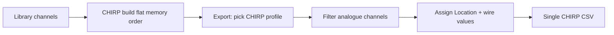

# CHIRP radio profiles

Per-radio constraints applied when exporting a codeplug to CHIRP CSV. Generic column semantics live in the parent [CHIRP reference](../../README.md).

## Why profiles exist

CHIRP exports are **radio-specific** — memory capacity, power levels, and supported modes vary by driver. The wire column set is largely shared, but:

- **Memory slots** (`Location` max index) differ by radio model.
- **Power ladder** wire strings (`5.0W`, `10W`, `1.0W`, …) are radio-specific.
- **Filename** convention encodes radio model for operator identification.

The **internal library model stays radio-agnostic**. Profiles apply at **export time** via the profile picker on build export.

## Intended export flow

Digital/DMR channels in a mixed project are **skipped** with warnings — CHIRP analogue export does not synthesise DMR rows.

## Profile index

| Profile id   | Hardware            | Fixture                           | Doc                            |
| ------------ | ------------------- | --------------------------------- | ------------------------------ |
| `chirp-uv5r` | Baofeng UV-5R Mini  | `Baofeng_UV-5R Mini_20251129.csv` | [chirp-uv5r.md](chirp-uv5r.md) |
| `chirp-uv21` | Baofeng UV-21Pro V2 | `Baofeng_UV-21ProV2_20251129.csv` | [chirp-uv21.md](chirp-uv21.md) |
| `chirp-rt95` | Retevis RT95 VOX    | `Retevis_RT95 VOX_20251106.csv`   | [chirp-rt95.md](chirp-rt95.md) |

Caps and ladders are verified against CHIRP Python drivers — [enum-verification.md](../enum-verification.md).

## Related

- [channels.md](../channels.md)
- [enum-verification.md](../enum-verification.md)
- [CHIRP feature hub](../../../../features/import-export/chirp/README.md)
